Can animal movement and remote sensing data help to improve conservation efforts?
================

-   [List of Abbreviations](#list-of-abbreviations)
-   [Motivation](#motivation)
-   [Drivers of habitat selection in migratory plains zebras](#drivers-of-habitat-selection-in-migratory-plains-zebras)
    -   [Abstract](#abstract)
    -   [Introduction](#introduction)
    -   [Materials and Methods](#materials-and-methods)
    -   [Results](#results)
    -   [Discussion](#discussion)
-   [Occurrence distribution and habitat use of Grevy’s and plains zebras](#occurrence-distribution-and-habitat-use-of-grevys-and-plains-zebras)
    -   [Abstract](#abstract-1)
    -   [Introduction](#introduction-1)
    -   [Materials and Methods](#materials-and-methods-1)
    -   [Results](#results-1)
    -   [Discussion](#discussion-1)
-   [Synthesis](#synthesis)
-   [References](#references)

<!--
Look at Naidoo2012 and Loarie2009a for nice examples for potential publication.
Convert awei into non-water/water classification and calculate distance to water!
Compare NDVI of dry vs. wet season derived from Landsat!!!
-->
List of Abbreviations
=====================

CO2 = Carbon Dioxide, LULCC = Land Use and Land Cover Change, PA = Protected Area, RS = Remote Sensing, NDVI = Normalised Difference Vegetation Index, SSF = Step Selection Function, MODIS = MODerate resolution Imaging Spectroradiometer, IUCN = International Union for Conservation of Nature, VI = Vegetation Index, AVHRR = Advanced Very High Resolution Radiometer, GIMMS = Global Inventory Modeling and Mapping Studies, WDPA = World Database on Protected Areas, EVI = Enhanced Vegetation Index, NIR = near infrared, SWIR = shortwave infrared, NDMI = Normalised Different Moisture Index, NDWI = Normalised Difference Water Index, MNDWI = Modified Normalised Difference Water Index, AWEI = Automated Water Extraction Index, WI2015 = 2015 Water Index, TM = Thematic Mapper, ETM+ = Enhanced Thematic Mapper Plus, SRTM = Shuttle Radar Topography Mission, IGBP = International Geosphere Biosphere Programme, RSF = Resource Selection Function, Global Positioning System = GPS, AKDE = Autocorrelated Kernel Density Estimator, CCA = Community Conservation Area

Motivation
==========

Since the beginning of the Industrial Revolution anthropogenic activities have an increasing effect on the global environment. By now these effects are so profound, that the term "Anthropocene" has been introduced to describe the current ecological epoch (Crutzen 2002, Steffen et al. 2007, Corlett 2015, Lewis and Maslin 2015). Fossil fuel emissions and land use change have caused an increase in carbon dioxide (CO2) concentrations by 40% compared to pre-industrial levels. The increase in atmospheric CO2 is the largest driver of climate change. Global surface temperature is predicted to be more than 1.5°C higher by the end of the 21st century relative to the average global surface temperature between 1850 and 1990 (IPCC 2013). Anthropogenic activities have not only affected the Earth's climate system, but have also considerably changed the world's ecosystems.

Land use and land cover change (LULCC) are considered to be one of the main effects of anthropogenic activities on the environment (Foley et al. 2005, Burkhard et al. 2012). LULCC are further acting synergistically to climate change, thus further amplifying the effect on the environment (Lambin et al. 2001, Opdam and Wascher 2004). LULCC can occur in the form of agricultural land-clearance, suburban sprawl, and timber harvests among others (Lambin et al. 2001) and lead to the degradation of ecosystem services (Burkhard et al. 2012), which on the long run causes significant harm to human well-being (Millenium Ecosystem Assessment 2005).

Not only humans are affected by the changes in our environment (Pereira et al. 2010). Biodiversity loss has increased dramatically in the Anthropocene and current extinction rates are estimated to be 1000 times higher than natural background rates of extinction (De Vos et al. 2015). As a result, (Dirzo et al. 2014) introduced the term "Anthropocene defaunation" to describe the global extinction of faunal species and populations and the decline in abundance of individuals within populations. Nevertheless, the impact of humans on biodiversity is an often underestimated form of global change.

LULCC are believed to have the strongest impact on biodiversity loss due to the resulting habitat loss and fragmentation (Fischer and Lindenmayer 2007). Habitat loss negatively affects species richness, genetic diversity, population abundance and distribution (Fahrig 2003). Habitat fragmentation negatively affects the fitness and movement of individuals (Cattarino et al. 2016). It forces some animals to move more often through human-dominated systems (Nogeire et al. 2015) or even leads to a reduction in the dispersal ability of an organism across the landscape (Opdam and Wascher 2004). Habitat fragmentation also hampers the ability of an individual to find suitable habitat (Cattarino et al. 2016). Climate change will further force many organisms to relocate to new climatically suitable habitats (Hof et al. 2011). If climate change occurs together with habitat fragmentation, it is likely to prevent animals from tracking these changes in the thermal landscape (Opdam and Wascher 2004). Mapping the areas, which are important for animal movement, thus plays a key role in conservation planning (Nogeire et al. 2015).

Protected areas (PAs) are the most important tool for *in situ* conservation of animals in their natural ecosystem in order to maintain biodiversity (Rodrigues et al. 2004, Chape et al. 2005). Around 14.6% of the Earth's land surface are currently protected (Butchart et al. 2015) and PAs represent a considerable amount of human land use (Chape et al. 2005, Foley et al. 2005). Nevertheless, they still fail to counteract species extinction. Butchart et al. (2015) estimated that 59-68% of ecoregions, 77-78% of important sites for biodiversity, and 57% of 25380 species have inadequate coverage. However, space for new parks and corridors is becoming more limited (McKinney 2002). Wittemyer et al. (2008a) found that PAs often lead to a displacement in population to the surrounding areas, thus reducing its effectiveness and the conservation of biodiversity. LULCC have also been shown to increase in surrounding areas of PAs (Hansen et al. 2004), which is likely to have a knock-on effect inside the PAs (Willis 2015). The surrounding areas of PAs were found to become increasingly fragmented (Nagendra 2008, Nagendra et al. 2009), hence reducing their functioning as ecological corridors, which in turn increases the isolation of PAs (DeFries et al. 2005). In addition, the establishment of PAs often does not correlate with identified conservation priorities (Chape et al. 2005) or ecological processes, but rather reflects political, jurisdictional, opportunistic, land-cover or land-use boundaries (DeFries et al. 2010). Management of existing PAs is often insufficient (Leverington et al. 2010) and particularly in the Tropics PAs are under severe threat (Chape et al. 2005).

The increasing human pressures on PAs, call for a globally consistent monitoring scheme, which covers large spatial areas, long time periods and is cost-efficient (Nicholson and Possingham 2006, Henry et al. 2008, Scholes et al. 2008), in order to assess the PAs' effectiveness (Nagendra et al. 2013). In order to meet the requirements for biodiversity conservation and ecosystem management with regard to global change, it is necessary to observe and correctly predict the habitat use of animals (Knegt et al. 2011) and so infer the areas that need to be protected (Widmann et al. 2015). This requires first of all good monitoring data, but also robust models (Honrado et al. 2016). As a result, Remote Sensing (RS) and movement ecology have turned into important disciplines in recent years (Turner et al. 2003).

In the past, RS has been primarily used to monitor abiotic conditions, such as rainfall, temperature, wind, elevation and bathymetry. But, it can also provide relevant information on the occurrence, extent and impact of environmental disturbances, such as flood, drought or fire and help to monitor the status of PAs by providing information on vegetation condition, anthropogenic disturbances and the distribution of invasive species (Nagendra et al. 2013, Pettorelli et al. 2014). RS has a key advantage compared to other methods, as it can be applied at a variety of spatial and temporal scales and is an efficient, unbiased, non-invasive, quantitative method (Willis 2015). Remote sensing can detect changes in ecological status or land-cover and can thus improve conservation abilities and assess the effectiveness of management without disturbing the landscape (Pettorelli et al. 2014, Wegmann et al. 2014, Willis 2015).

Movement ecology tries to answer fundamental questions about the movement of an organism, which is driven by the organism's internal state, its motion and navigation capacities and external factors (Nathan et al. 2008). However, the latter mostly determines an animal's decision to move, as it does not move just for changing its location, but rather for changing the environmental conditions it experiences at its location (Van Moorter et al. 2016). Animal movement drives many essential ecological processes, such as migration and dispersal, which influence population dynamics, animal behaviour, as well as the distribution and persistence of biodiversity (Jeltsch et al. 2013, Bauer and Hoye 2014, McClintock et al. 2014, Barton et al. 2015). The movement of animals can be studied using a variety of methods (telemetry, mark-capture, occupancy analysis, diet analysis or through the development of mechanistic models) (Driscoll et al. 2014) and recent advances in animal tracking devices have tremendously facilitated movement ecology (Cooke et al. 2004, Wilson2008a, Rutz2009, Urbano2010). It allows to track multiple individuals over large distances and for extensive time periods (multiple years).

Together with the vast availability of publicly accessible remotely-sensed environmental data, this has helped us to understand the environmental drivers of movement patterns at various spatial and temporal scales (Trierweiler et al. 2013, Pettorelli et al. 2014, Neumann et al. 2015). This tells us if the environment inhibits or fosters movement (Fahrig 2007, Beyer et al. 2016) and how it influences distribution patterns and population dynamics (Trierweiler et al. 2013). The infered knowledge can then be fed into predictive models and used to inform management and conservation practices (Avgar et al. 2013). Thus, knowledge about the environment, e.g. derived from RS data, and the movement of an animal can considerably help to conserve and manage biodiversity (Knegt et al. 2011, Driscoll et al. 2014, Barton et al. 2015, Neumann et al. 2015).

Drivers of habitat selection in migratory plains zebras
=======================================================

Abstract
--------

Climate and land-use change have a growing influence on the world's ecosystems, in particular in Africa, and increasingly threaten wildlife. The resulting habitat loss and fragmentation can impede animal movement, which is especially true for migratory species. Ungulate migration has declined in recent years, but its drivers are still unclear. Animal movement and remote sensing data was combined to analyse the influence of various vegetation and water indices on the habitat selection of migratory plains zebras in Botswana's Ngamiland. The study area experienced a more or less steady state in Normalised Difference Vegetation Index (NDVI) over the last 33 years. More than half of the study area was covered by PAs. NDVI increased stronger in PAs compared to areas that were not protected. NDVI was always higher in the Okavango Delta compared to the Makgadikgadi Pans. Although zebras are thought to select for areas with high NDVI, they experienced a lower NDVI in the Makgadikgadi grasslands during wet season. Step selection functions (SSFs) showed that NDVI derived from Landsat as well as NDVI derived from the Moderate Resolution Imaging Spectroradiometer (MODIS) were significant drivers of habitat selection across all individuals. Migration seems to be driven by the high nutritional value of the Makgadikgadi grasslands and not seasonal resource limitation. Landsat imagery was shown to provide different environmental information compared to MODIS data. This highlights not only the importance of NDVI for explaining animal movement, but also the importance of Landsat imagery for monitoring habitat extent and fragmentation. Incorporating the animal's behavioural state and memory into SSFs will help to improve our ecological understanding of animal movement in the futurue.

**Keywords:** remote sensing, animal movement, protected areas, conservation, plains zebras, habitat selection, normalised difference vegetation index, step selection functions, Ngamiland, Botswana.

Introduction
------------

In Africa, the socio-economic development of the past 30 years has led to severe habitat loss and fragmentation. Future biodiversity scenarios predict that Africa is one of the continents with the largest habitat loss by 2050 (Visconti et al. 2011). All this results in an increased and unprecedented threat to wildlife (Newmark and Hough 2000, Brooks et al. 2002, Newmark 2008) and many large mammal populations in Africa have been declining (Craigie et al. 2010). Wegmann et al. (2014) found that PAs in southern and eastern Africa, e.g. Botswana and Kenya, had a high irreplaceability compared to the PAs in West and North Africa. This is likely due to their larger size or the fact that PAs in southern and eastern Africa host a higher number of large mammal species (Rondinini et al. 2005).

Habitat loss, fragmentation and the expansion of infrastructure can impede the movement of animals and so reduce animal interactions, population connectivity and genetic exchange (Fischer and Lindenmayer 2007, Kaczensky et al. 2011, Zeller et al. 2012, Tracey et al. 2013). Migratory animals have large area requirements and consequently are particularly susceptible to these anthropogenic changes (Berger 2004, Bolger et al. 2008, Wilcove and Wikelski 2008). Migration, the seasonal return movement of populations between two areas, is a common global ecological phenomenon (Alerstam et al. 2003, Dingle and Drake 2007, Bolger et al. 2008, Teitelbaum et al. 2015). It helps to maintain biodiversity and the resilience of ecosystems, as it furthers the transfer of energy and genetic information (Jeltsch et al. 2013, Bauer and Hoye 2014, Pettorelli et al. 2014). The population numbers and available habitat of many migratory species are declining, due to habitat alteration, range restriction, overexploitation and climate change, while some migrations have already been entirely extinguished or are highly threatened (Fryxell and Sinclair 1988, Serneels and Lambin 2001, Berger 2004, Bolger et al. 2008, Wilcove and Wikelski 2008, Harris et al. 2009). The role of long-distance migrations in maintaining local and global patterns of species distributions and ecosystem function is not well understood (Jeltsch et al. 2013) and little is known about how climate change may affect animal movement in the future. All of this makes long-distance migrations extremely difficult to conserve (Wilcove and Wikelski 2008).

Complete migration is rather uncommon as most species only partially migrate, meaning that some individuals in a population undertake seasonal migrations, while others remain in one place for the entire year (Dingle and Drake 2007, Chapman et al. 2011). Individuals within a population can be genetically predisposed to migration (Berthold and Querner 1981), or their behaviour might depend on variation in individual, social or environmental factors (White et al. 2007, Barton et al. 2015). Partial migration is especially common when resource availability is highly variable through time and density dependence prevails, while more or less static landscapes favour sedentary ranges (Taylor and Norris 2007, Mueller and Fagan 2008, Mueller et al. 2011, Boettiger et al. 2015).

Migration of animals is mostly driven by seasonal variation in resource availability (e.g. phenology, water availability, weather and climate), specific nutrient demands, intra-specific competition, predation, parasitism or extreme climatic conditions (Fryxell and Sinclair 1988, Alerstam et al. 2003, Bolger et al. 2008). The importance of different factors varies in space (seasonal versus non-seasonal environments) (Knegt et al. 2011) and time (intra- and interannual variation) (Boone et al. 2006), but also differs among species (Singh et al. 2010).

In general, the spatial distribution of foraging resources is thought to be the dominant driver of animal movement (Berger 2004, Schweiger et al. 2015). This has been extensively tested by using spatial and temporal variation in vegetation indices, such as NDVI, as a proxy for food availability (Fryxell et al. 2005, Pettorelli et al. 2005, Hebblewhite et al. 2008, Mueller et al. 2008, Bartlam-Brooks et al. 2013, Trierweiler et al. 2013, Bohrer et al. 2014, Boettiger et al. 2015, Neumann et al. 2015, Teitelbaum et al. 2015).

In the Tropics, seasonality is primarily defined by differences in precipitation and not in temperature (Naidoo et al. 2012). African semi-arid grasslands thus tend to be limited by water availability rather than nutrients (Breman and Wit 1983). Migratory behaviour in these regions is thus more likely driven by the availability of drinking water (Redfern et al. 2005, Beer and Aarde 2008). Precipitation is considered as one of the main drivers of ungulate migration (Bolger et al. 2008, Harris et al. 2009) and zebras were found to time their migration according to rainfall events (Bartlam-Brooks et al. 2011, Naidoo et al. 2014). While rainfall itself might supply water to formerly dry areas and so increase space use, it may also increase the heat loss in individuals and so decrease space use (Rivrud et al. 2010, Beest et al. 2011). Rainfall also promotes vegetation growth, thus indirectly providing more foraging resources (Okitsu 2005). Combining a measure for vegetation with precipitation data improved the prediction of the timing and speed of the migration of plains zebras (*Equus burchelli*) (Bartlam-Brooks et al. 2013).

Forage quality is also an important driver of animal movement (Berger 2004, Schweiger et al. 2015). African grasslands show substantial seasonal and spatial variation in forage quality (Breman and Wit 1983), which is negatively related to annual precipitation and primary production. Furthermore, mortality rates of African herbivores are more strongly related to foraging quality than to resource abundance (Sinclair et al. 1985, Fryxell 1987). Migratory grazers in the Serengeti, such as wildebeest, were found to move away from resource-rich areas to short grasslands with low annual rainfall at the beginning of the wet season. There they gain access to less abundant, nutrient-rich foraging grounds and avoid predation. During dry season they then return to the resource-rich areas (Fryxell and Sinclair 1988, Coughenour 1991). Nevertheless, during wet season wildebeest and other ungulates still follow rainfall and plant regrowth within the less abundant foraging grounds (McNaughton 1985, Durant et al. 1988).

Migratory behaviour is likely driven by a combination of factors acting synergistically. For example, the cause or timing of wildebeest migration was shown to be influenced by green forage (Boone et al. 2006) or rainfall leading to green forage (Talbot and Talbot 1963), compensatory vegetative production (McNaughton 1976), areas of fewer diseases or predators (Darling 1960, Fryxell and Sinclair 1988), higher quality water (Gereta and Wolanski 1998), minerals (Kreulen 1975) and resources synchronously, to reduce competition with resident ungulates and swamp predators during the calving season (Estes 1976).

Spatio-temporal variation in resource availability has important ecological and conservation implications, in particular for wide-ranging species, such as ungulates. Human activity increasingly threatens wide-ranging ungulate populations (Berger 2004, Harris et al. 2009). Due to increasing ecosystem loss and fragmentation there has been a decline in ungulate migrations in grassland and boreal woodland ecosystems in recent years (Olson et al. 2010, Bartlam-Brooks et al. 2011, 2013).

This calls for immediate action to identify and prioritise migration routes for conservation (Sawyer et al. 2009). Conservation of migratory movements often requires the protection of vast areas, which is a challenging task (Thirgood et al. 2004). In the past, partially protected and poorly understood populations have collapsed (Bolger et al. 2008, Harris et al. 2009).

Quantifying migration occurrence, migration parameters and their environmental drivers is essential to understand the animal's movement and so derive conservation measures and monitor changes in migratory behaviour due to anthropogenic effects (Berger 2004, Bolger et al. 2008, Wilcove and Wikelski 2008, Katzner et al. 2012, Bauer and Hoye 2014, Naidoo et al. 2014). Therefore, multiple individuals across a variety of environmental conditions need to be studied, so that the population spread and habitat selection of these individuals can be modelled (Avgar et al. 2013). Migration timing and speed of plains zebras has been modelled by looking at perceptual cues (Bartlam-Brooks et al. 2013), while Bracis and Mueller (2017) further investigated if the migratory direction is a result of perceptually- or memory-guided changes in resources.

In this chapter, the effectiveness of current protection measures and the habitat selection of plains zebras will be analysed by addressing the following questions:

-   Has there been an increase or loss in vegetation over the last 30 years?
-   Is vegetation loss greater within and in close proximity to PAs?
-   What are the movement characteristics of migratory plains zebras?
-   What is the major driver of habitat selection in plains zebras?

Materials and Methods
---------------------

### Study Area

The study area was delineated by the extent of our movement data plus a 5 % margin. It lies between 23.4° and 25.4°E Longitude and between -20.9° and -19.2°S Latitude, and covers an area of 39588 km2 and extends from the Okavango Delta in the northwest district to the Makgadikgadi grasslands in the central district of Botswana (Fig. 1). The area is characterised by a semi-arid climate (Fig. S1). Temperature is relatively constant through time and space and the mean temperature ranges from 15.5 to 26.2°C over the course of the year. Mean annual rainfall lies between 0 and 104 mm per month and varies between and within seasons. Most of the rainfall (325 mm) occurs during the rainy season (December - April), while during the dry season (April - December) precipitation only reaches 94 mm (Fig. S1) (Hijmans et al. 2005). The area is generally flat with a low variation in altitude (884 - 1018 m) (Fig. S2).

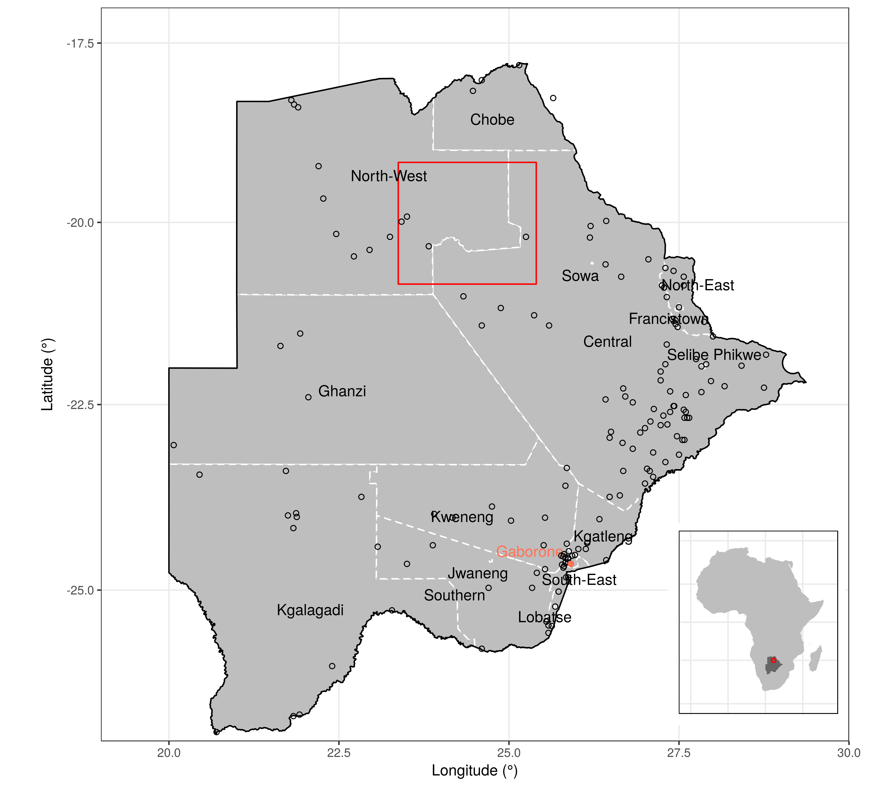

**Fig. 1.** Map of Botswana with the study area indicated in red. District boundaries are shown by white dashed lines. The location of all cities with a population of more than 40000 people is shown and the capital city is highlighted in orange. Administrative boundaries were obtained from <http://www.gadm.org> using the `raster` package (Bivand et al. 2016). Locations of cities were obtained from the `maps` package (Becker et al. 2016).

Savanna ecosystems are tropical and subtropical grasslands intermixed with a discontinuous layer of trees and shrubs. They typically form a heterogeneous landscape, which is influenced by rainfall, soil type, grazing, browsing, fire and their interactions (Knegt et al. 2008, Shorrocks and Bates 2014). African savannas are dominated by C4 plants, which have a very high photosynthetic efficiency, as they have to overcome periodic burning, seasonal drought and flood. C4 plants are extremely poor quality food for most herbivores, vertebrates or invertebrates, but ungulates can break down cellulose and so are adapted to forage on these plants (Shorrocks and Bates 2014).

The Okavango Delta, the world's largest Ramsar Wetland of International Importance, is the only permanent water body in north-western Botswana. It is fed by the Okavango River, the second largest river in southern Africa. The mean annual inflow to the Okavango Delta is 11 x 109 m3, which is augmented by 45.5 % of rain. Almost all of the water (96 %) is lost to the atmosphere by evapotranspiration, 2 % flow out of the system as surface flow and the remaining 2 % is lost to groundwater (Ellery and McCarthy 1998). Between 3000 and 5000 km2 of the Delta usually remains inundated during the low flood season in December. In August the Delta extends to 6000 sometimes even up to 12000 km2 (Kgathi et al. 2014). Most ecological processes in the Okavango Delta system are driven by the annual flood pulse, as the availability of resources depends on rainfall and the water flow of the Okavango River. Both have declined between the 1970s and 2000s (Kgathi et al. 2014). Due to its permanent water resources, rich grasslands and forests and the resulting wildlife biodiversity the Okavango Delta is an attractive area for various interest groups. This leads to a growing human demand of natural resources.

The Makgadikgadi Pans is a complex of salt pans, which lies south of the Okavango Delta at a distance of approximately 250 km. The area lies below 950 meters. Some salt pans are covered with salt-tolerant grasses, but most of them are covered by saline and highly alkaline mud. During the rainy season the pans are partly filled with shallow water, while in the dry season the water rapidly dries out and saltbubbles and encrustations form on the surface (Cooke 1979). Occassionally the Okavango Delta floods reach the Makgadikgadi Pans (Varis et al. 2008), but this has not happened since 1991 (White and Eckardt 2006). The lacustrine soils of the Makgadikgadi support grasses with high protein and mineral content which are particularly utilised by ungulates (Baillieul 1979).

### Plains zebra

There are three species of zebras in Africa, the plains zebra (*Equus burchelli*), the Grevy's zebra (*Equus grevyi*) and the mountain zebra (*Equus zebra*). The plains or common zebra is Africa's most abundant and widespread wild horse (shoulder height 1.3 m, weight 175 - 300 kg) and includes several subspecies.

Until 15 years ago, plains zebras were found in nearly all countries of eastern, southern and south-western Africa, since then they have been extirpated from several parts of their range (Hack et al. 2002). By now, plains zebras are listed as "Near Threatened" on the International Union for Conservation of Nature (IUCN) Red List of Species as there has been a population decline of 24% over the last 14 years (King and Moehlman 2016). They can be found in a wide range of savanna habitats, from short or tall grassland, to open woodland in East and Southern Africa, as they typically inhabit grassland areas (McNaughton and Georgiadis 1986). Grass constitutes nearly all of the zebra's diet. They particularly favour *Themeda triandra*, *Cynodon dactylon*, *Eragrostis superba* and *Cenchrus ciliaris*. Occassionaly, they might browse or dig up corms and rhizomes in particular during the dry season (Grubb 1981). Zebras are hindgut fermenters, which means that cellulose digestion takes place after normal digestion, in the caecum. Hindgut fermenters are less efficient but pass food faster through their digestive system than foregut fermenters. They can therefore use lower quality food and are adaptive rather than selective grazers (Shorrocks and Bates 2014). Zebras have to graze frequently throughout the day and night (Fischhoff et al. 2007a) and are more strongly water dependent than other ungulate species, such as wildebeest. During dry season their distribution is confined to areas where perennial water sources are available (Kgathi and Kalikawe 1993), as they have to drink approximately once a day (Fischhoff et al. 2007a). They typically live in small harems, which consist of one stallion male and one to eight females and their dependent offspring. When the offspring reaches sexual maturity they leave their natal harem and the males join together in bachelor herds. While harems usually remain stable over years, herds (groups of multiple harems) are typically unstable and can change over hours to days. After a gestation period of around one year females produce a single foal (30-35 kg). They usually give birth at the start of the rainy season, when forage availability is high (Fischhoff et al. 2007a, 2007b).

### Movement Data

Movement data of seven adult female plains zebras was obtained from the Movebank Data Repository (Bartlam-Brooks and Harris 2013). Only females were tagged to avoid sex- or age-specific biases. Zebras were tagged in October 2007, August and October 2008. Their position was recorded every hour, apart from one individual (Z3864), which was tracked every 15 minutes. In total, the dataset contained 53776 point locations and covered a time span of 20 months (Table 1).

**Table 1.** Start and end date of the tracking period, tracking duration (days), total distance (km) and median time interval (min) of each individual zebra.

<table>
<colgroup>
<col width="7%" />
<col width="15%" />
<col width="12%" />
<col width="21%" />
<col width="18%" />
<col width="24%" />
</colgroup>
<thead>
<tr class="header">
<th align="center">ID</th>
<th align="center">Start date</th>
<th align="center">End date</th>
<th align="center">Duration (days)</th>
<th align="center">Distance (km)</th>
<th align="center">Time interval (min)</th>
</tr>
</thead>
<tbody>
<tr class="odd">
<td align="center">Z3864</td>
<td align="center">2007-10-25</td>
<td align="center">2008-01-05</td>
<td align="center">72.19</td>
<td align="center">1124</td>
<td align="center">16</td>
</tr>
<tr class="even">
<td align="center">Z3743</td>
<td align="center">2007-10-28</td>
<td align="center">2008-08-28</td>
<td align="center">305.4</td>
<td align="center">3750</td>
<td align="center">59</td>
</tr>
<tr class="odd">
<td align="center">Z3866</td>
<td align="center">2007-10-25</td>
<td align="center">2008-10-22</td>
<td align="center">363.6</td>
<td align="center">4087</td>
<td align="center">59</td>
</tr>
<tr class="even">
<td align="center">Z6402</td>
<td align="center">2008-10-24</td>
<td align="center">2009-04-21</td>
<td align="center">179</td>
<td align="center">2210</td>
<td align="center">60</td>
</tr>
<tr class="odd">
<td align="center">Z6405</td>
<td align="center">2008-08-27</td>
<td align="center">2009-03-31</td>
<td align="center">216.6</td>
<td align="center">2532</td>
<td align="center">60</td>
</tr>
<tr class="even">
<td align="center">Z6407</td>
<td align="center">2008-08-27</td>
<td align="center">2009-05-27</td>
<td align="center">273.2</td>
<td align="center">3409</td>
<td align="center">59</td>
</tr>
<tr class="odd">
<td align="center">Z6399</td>
<td align="center">2008-10-24</td>
<td align="center">2009-06-01</td>
<td align="center">220.2</td>
<td align="center">3035</td>
<td align="center">60</td>
</tr>
</tbody>
</table>

<!--
The fence is clearly visible on very high resolution satellite imagery and a digital version of the fence was drawn by hand using the Google Satellite `OpenLayers` plugin in QGIS [@QGISDevelopmentTeam2016] (see Fig. \ref{fig:zebra_overview_bwa}). 

There is a fence east of Nxai Pan NP, which we ignored, see Naidoo et al. 2013.
-->
### Environmental Data

In environmental conservation and ecology vegetation indices (VIs) are commonly used as proxies for vegetation greenness and primary productivity (Pettorelli et al. 2011, Neumann et al. 2015). NDVI is calculated as the ratio of red (RED) and near-infrared (NIR) reflectance:

*N**D**V**I* = (*N**I**R* − *R**E**D*)/(*N**I**R* + *R**E**D*)

The resulting NDVI values range from -1 to +1. High NDVI values represent healthy vegetation, as it absorbs most light in the RED part and strongly reflects in the NIR part (Pettorelli et al. 2005).

NDVI data derived from the Advanced Very High-Resolution Radiometer (AVHRR) is the only continuous long-term NDVI product and so a valuable tool for analysing long-term changes in vegetation. The Global Inventory Modeling and Mapping Studies (GIMMS) group provides bi-monthly maximum NDVI values on a coarse spatial resolution of 8 x 8 km (Pinzon and Tucker 2014). The GIMMS NDVI3g data is not atmospherically corrected, except for two volcanic stratospheric aerosol periods (1982-1984 and 1991-1994), however the data has been corrected for orbital drift by removing common trends between the solar zenith angle and NDVI using the empirical mode decomposition method (Campo-Bescós et al. 2013).

Global AVHRR GIMMS NDVI3g binary data from January 1982 to December 2013 were obtained from <http://ecocast.arc.nasa.gov/data/pub/gimms/3g.v0/>. The data was cropped to the extent of our study area. Following the procedure of Wegmann et al. (2014), the change in NDVI for each pixel within our study area was calculated using linear regressions (Fig. 3).

The spatial extent of all protected areas within the study area was accessed through the World Database on Protected Areas (WDPA) at <http://protectedplanet.net>. Based on the PA boundary, three zones were differentiated: Protected, 5km Buffer (area outside a PA but less than 5 km from the PA boundary) and Unprotected (Fig. S4). We compared the slope and adjusted R2 of change in NDVI for every pixel with a significant linear relationship (p &lt; 0.05) among each of the three zones (Fig. 5).

The Moderate Resolution Imaging Spectroradiometer (MODIS) provides two VI products, NDVI and EVI, on a large spatial (global) and temporal scale (2001 - 2013) and so is ideal for studying animal movement (Pettorelli et al. 2011). In the past, migratory movement studies have often used spatio-temporal NDVI data. Other VIs, such as the Enhanced Vegetation Index (EVI), have been less commonly used (Neumann et al. 2015). The EVI de-couples vegetation and canopy background and reduces influences of the atmosphere (Huete et al. 2002) and is calculated by:

*E**V**I* = 2.5 × (*N**I**R* − *R**E**D*)/(*N**I**R* + 6.0 × *R**E**D* − 7.5 × *B**L**U**E* + 1.0)

MODIS NDVI & EVI layers and respective quality layers for the entire study area and time span of our movement data were derived from the MOD13Q1 and MYD13Q1 V006 products, which were downloaded from the Land Processes Distributed Active Archive Center (<http://lpdaac.usgs.gov/>) using the `MODIS` package (Mattiuzzi 2016). The vegetation index layers were filtered by the quality layer to remove unreliable pixel values. MOD13Q1 and MYD13Q1 products provide 16-day composites, which are shifted in time, at a moderate spatial resolution of 250 m. The two products were combined to increase the temporal resolution, which resulting in 8-day layers for each index from October 2007 to June 2009.

MODIS MOD09A1 and MYD09A1 V006 surface reflectance layers (7 bands = RED, NIR, BLUE, GREEN, NIR2, shortwave infrared 1 (SWIR1), SWIR2) were obtained in order to derived additional VIs. The data was pre-processed using the same procedure as for the MODIS MOD13Q1 and MYD13Q1 products. The temporal resolution of these two products is twice as high, but the spatial resolution is only half as good. This resulted in 146 layers for each band with a temporal resolution of 4 days and a spatial resolution of 500 m. NDVI and EVI were then calculated using the above mentioned equations, in order to compare the effect of the two different resolutions.

From the surface reflectance layers the Normalised Difference Moisture Index (NDMI) (Jin and Sader 2005) was calculated by:

*N**D**M**I* = (*N**I**R* − *S**W**I**R*1)/(*N**I**R* + *S**W**I**R*1)

The different bands were further used to calculate the Normalised Difference Water Index (NDWIMcF) (McFeeters 1996):

*N**D**W**I**M**c**F* = (*G**R**E**E**N* − *N**I**R*)/(*G**R**E**E**N* + *N**I**R*)

The Modified Normalised Difference Water Index (NDWIXu) was calculated following the procedure by Xu (2006):

*N**D**W**I**X**u* = (*G**R**E**E**N* − *S**W**I**R*1)/(*G**R**E**E**N* + *S**W**I**R*1)

Two different versions of the automated water extraction index (AWEIns, AWEIsh) were also calculated:

*A**W**E**I**n**s* = 4 × (*G**R**E**E**N* − *S**W**I**R*1)−(0.25 × *N**I**R* + 2.75 × *S**W**I**R*2)
$$ AWEI\_{sh} = BLUE + 2.5\\times GREEN - 1.5\\times(NIR + SWIR1) - (0.25\\timesSWIR2) $$

AWEIsh is ideally used in situations where shadows are a major source of accuracy loss, while AWEIns is proposed for areas where shadows are not a major problem, but surfaces such as snow, ice and high albedo built surfaces are present. In areas where no shadow, no dark urban backgrounds and no high-albedo surfaces occur, either of the two can be used (Feyisa et al. 2014). And finally the 2015 water index (WI2015) (Fisher et al. 2016) was calculated:

*W**I*2015 = 1.7204 + 171 × *G**R**E**E**N* + 3 × *R**E**D* − 70 × *N**I**R* − 45 × *S**W**I**R*1 − 71 × *S**W**I**R*2

All seven bands were further used to apply the tasseled cap transformation. This transformation provides a way of reducing the data dimensionality and outputs six new bands, of which the first three usually account for most of the variation (Crist and Cicone 1984). These first three bands are commonly labeled as brightness, greenness and wetness and were used as additional VIs. Brightness highlights surfaces with little or no vegetation. Greenness is defined by enhanced absorption of the visible spectrum and high reflectance in infrared. Wetness has been shown to be sensitive to soil and plant moisture (Crist and Cicone 1984) and vegetation structure (Jin and Sader 2005, Vorovencii 2007).

Surface reflectance Landsat 5 Thematic Mapper (TM) and Landsat 7 Enhanced Thematic Mapper Plus (ETM+) images consisting of 6 different bands (BLUE, GREEN, RED, NIR, SWIR1 and SWIR2) were downloaded for the entire study area and time span from EarthExplorer (<http://earthexplorer.usgs.gov/>). Landsat TM and ETM+ imagery provide freely-accessible high resolution (30 m) data. A mosaick of 5 different scenes, recorded within less than 10 days from each other, was used to cover the entire study area. Landsat images are generally available at a 16-day interval, however surface reflectance images were not available for every time step and so images were only available for irregular time intervals. In total, 54 Landsat 5 TM and 104 Landsat 7 ETM+ scenes were processed resulting in 43 temporal layers. Topographic illumination correction was applied to each image using the NASA Shuttle Radar Trans Mission (SRTM) Global V003 elevation data at a resolution of 30 meters (NASA JPL 2013). Afterwards, clouds, shadows and adjacent clouds were masked from each image. The mosaicked images were used to calculate the same indices as for the MODIS MOD09A1 and MYD09A1 V006 reflectance data. During the time of the study the LSC-correction of the Landsat 7 ETM+ scenes was switched off, resulting in obscured images. To obtain complete VI scenes at a regular time interval, monthly mean images were calculated and only these were used for further analysis.

SRTM elevation data for the study area was obtained from the NASA Land Processes Distributed Active Archive Center (<http://gdex.cr.usgs.gov/gdex/>) (NASA JPL 2013). In addition to topographic illumination correction the elevation data was used to calculate slope and aspect (direction of slope) for each pixel using its eight neighbouring cells (Horn 1981) (Fig. S2).

The annual MODIS Land Cover Type (MCD12Q1 V006) product at a resolution of 500 m was obtained for the entire study area and time span that it is available (2001 - 2013) (Fig. S5). The International Geosphere Biosphere Programme (IGBP) scheme was used, which provides 17 different land cover classes. It is derived through supervised decision-tree classifications using 1370 training sites and has a global accuracy of 75 % (Cohen et al. 2006).

### Movement Analysis

<!--
Movement data was cleaned by removing all locations that were missing one of the two coordinates. Variation in speed and direction over time and between individuals was assessed visually (Fig. \ref{fig:speed_bwa}, \ref{fig:time_speed_bwa}, \ref{fig:speed_hour_bwa}, \ref{fig:speed_month_bwa}, \ref{fig:angle_polar_bwa}). Maps of the movement paths of each individual (Fig. \ref{fig:zebra_individual_bwa}) and maps of the monthly point locations were created (Fig. S8). 
-->
Movement data was categorised into seasons (Fig. S6). Months where precipitation was below the temperature curve, were defined as dry season (April - December), while months with higher precipitation than temperature were defined as rainy season (December - April) (Fig. S1).

Migration is often defined based on the distance travelled, e.g. if the animal is covering a distance which is greater than the daily average (Cagnacci et al. 2016). Movement data were divided into 4 segments: Southern migration, Northern migration, Southern Range, Northern Range. To define the southern migration, the mean location of all individuals between 20th and 31st October was calculated as a start point and the mean location of all individuals between 25th - 30th November was calculated as end point. These dates were based on the findings of Bartlam-Brooks et al. (2013). For each individual the time when the individual was more than 25 km away from the start point after the 20th of October was derived and used as start of the southern migration. The end of the southern migration was determined as the date when the individual was less than 5 km or the minimum distance away from the end point of the migration. For the northern migration the start point was calculated as the mean location of all individuals between the 1st of March and the 1st of April and the end point was calculated as the mean location between 1st of June and 1st of July. To start their northern migration zebras had to be more than 25 km away from the start point and to end their northern migration they had to be closer than 5km to the end point otherwise the time when the came closest to the end point was used (Table 4). Movement points in between the northern and southern migration were classified into southern or northern range accordingly (Fig. S9).

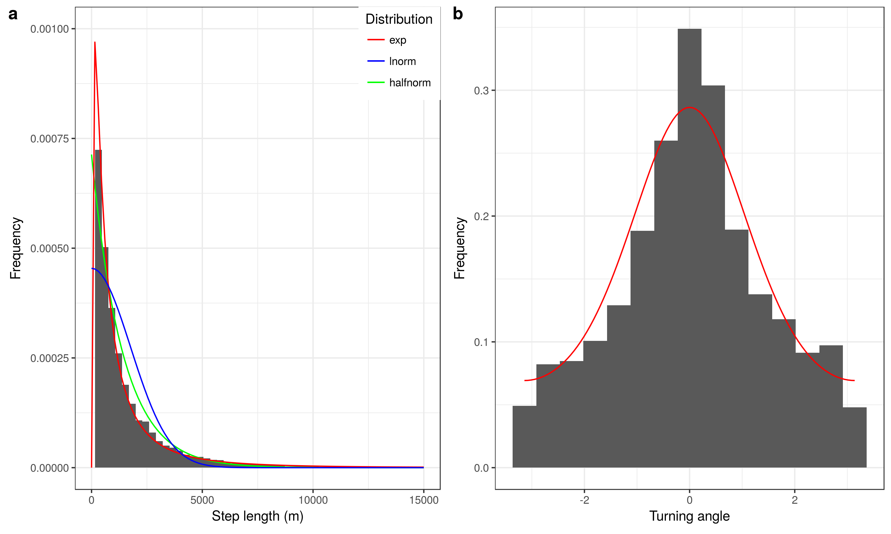 **Fig. 2.** Histogram of the step length and turning angle of the zebra movement data of Botswana. Exponential (red), lognormal (blue) and halfnormal (green) distribution were fitted to the step length. A van Mises distribution was fitted to the turning angle.

The mean location of the previously defined start and end points of migration were used as departure and destination points. From these we derived a distance to point raster layer at a resolution of 30 m (Fig. S3). The goal layer was used in our step selection function models to avoid autocorrelation due to the migratory behaviour of our zebras.

Autocorrelation of our data was assessed by fitting a variogram for each individual using the `ctmm` package (Fig. S7) (Fleming and Calabrese 2016). From this we decided to thin our data to a 3 hour interval in order to avoid correlation among subsequent steps. The distribution in step length, the straight line distance between successive locations, and turning angle, the angle subtended by two successive steps, were assessed by fitting various distributions (Fig. ). A half-normal distribution corresponded best with the step length.

In order to simulate locations, where zebras did not go but theoretically could have gone, 100 absence points were randomly sampled for every 3 hourly movement step of each individual (Fig. S10) from a half-normal distribution with twice the maximum step length for the steps and a radially symmetric proposal distribution for the turning angle. This resulted in a total of 1100698 points (1089800 absence points, 10898 presence points).

For each absence and presence point the altitude, slope, aspect and the distance to goal was extracted. For the satellite data (Landsat, M.D09, M.D13), the points that were falling within the corresponding time interval (4 days, 8 days, 1 month) were selected and the values of the calculated indices for the specific time and coordinates were extracted. In total, we ended up with 28 explanatory variables. The Pearson pairwise correlation of these variables was assessed (Fig. S11) and all model combinations of uncorrelated explanatory variables (r &lt; 0.7) were derived (Table S3).

SSFs offer a way to analyse the interaction of an animal's movement with the environment it encouters. It is composed of a resource-independent movement kernel and a resource selection function (RSF) (Forester et al. 2009). Selection is defined as use or non-use of a resource unit when encountered. SSFs were fitted using logistic regression with the cosine of the turning angle and the id of each absence and presence step sequence as explanatory variables.

The variable importance was assessed by fitting SSFs for all model combinations and each individual separately. The mean AIC among individuals was calculated for each model and the model with the best fit, indicated by the model with the lowest Akaike Information Criteria (AIC), was kept (Table S4). Model selection of the remaining model was done by stepwise backward selection, where one by one the least significant variable was dropped until only significant (p &lt; 0.05) variables remain.

<!--
Note: No interaction terms are needed for clogit. I did not test for autocorrelation in the residuals. Cross-validation is still missing. R2 values and coefficients are not mentioned. 
Note: We need to consider species cannot jump from one location to the next but has to be close-by (i.e. altitude example from Björn)

All analyses were performed in R version 3.3.3 [@RCoreTeam2016}, using mainly the R packages `raster` [@Hijmans2016a], `rgdal` [@Bivand2016a], `rgeos` [@Bivand2016a], `RStoolbox` [@Leutner2016], `move` [@Kranstauber2016a] and `ctmm` [@Fleming2016].
-->
Results
-------

### Vegetation changes

<!--
NDVI showed a highly seasonal pattern (Fig. \ref{fig:ndvi_1yr_mn_bwa}). Looking at the trend in NDVI, 
-->
35.5 % of the study area, in particular the south-eastern corner, showed a significant increase in NDVI over the last 33 years (1981 - 2013). The slope in NDVI only varied between -5.84759e-06 and 8.478647e-06. High adjusted R2 values coincided with high slope values, but again adjusted R2 was not very high (0 - 0.15, Fig. 3).

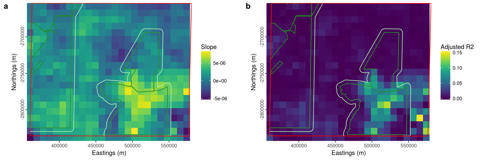 **Fig. 3.** Slope and adjusted R2 of the GIMMS NDVI3g time series for the study area in Botswana. Green lines indicate outline of protected areas and the surrounding 5 km buffer.

86.9 - 91.1 % of the study area was covered by savannas. The remainder was mostly covered by open shrublands (4.3 - 8.6 %) or barren or sparsely vegetated surfaces (3.6 - 3.9 %). The cover of savannas dropped by 4 % from 2008 - 2009, while open shrublands increased by 4 % (Table S2).

From 2001 to 2013 we observed a slight drop in savanna areas and a slight increase in open shrublands, but otherwise land cover appeared to be fairly stable (Fig. 4, Fig. S5).

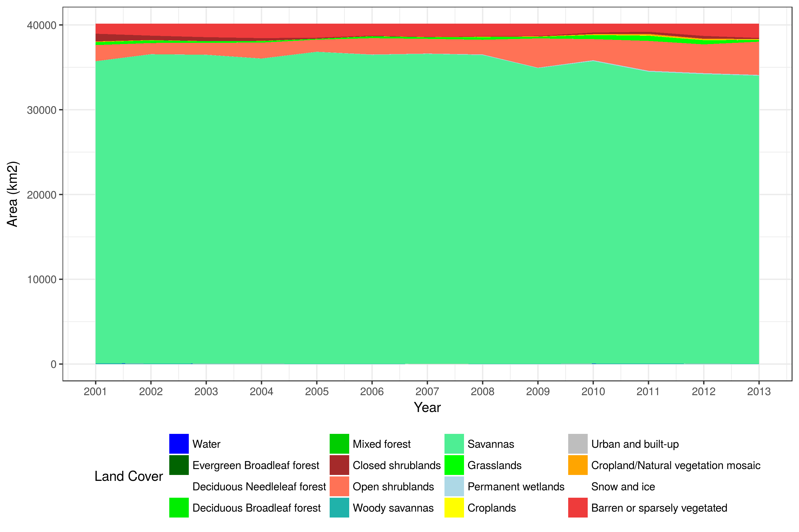 **Fig. 4.** Coverage of each land cover class from 2001 - 2013 for the study area in Botswana.

The study area is covered by seven PAs, which cover 52.2 % of the entire study area. The 5 km buffer zones around the PAs covered 8.8 % of the study area. Five PAs are formally protected, that means the fall within one of the six IUCN protected area management categories (Dudley 2008). Six PAs have been designated many years ago (1963 - 1996). The Moremi Game Reserve, an exclusive area for wildlife and wilderness conservation, has already been established in 1963, while the Okavango Delta World Heritage Site has only been inscribed in 2014 and is not designated yet. The older protected areas are generally small in size, but have a high conservation priority, while the newer protected areas cover a larger area, but have a lower designation status (Table 2).

**Table 2.** Summary of the Protected Areas of the study area.

<table>
<colgroup>
<col width="26%" />
<col width="30%" />
<col width="19%" />
<col width="15%" />
<col width="7%" />
</colgroup>
<thead>
<tr class="header">
<th align="center">Name</th>
<th align="center">Designation</th>
<th align="center">IUCN Category</th>
<th align="center">Area (km2)</th>
<th align="center">Year</th>
</tr>
</thead>
<tbody>
<tr class="odd">
<td align="center">Maun</td>
<td align="center">Game Sanctuary</td>
<td align="center">IV</td>
<td align="center">85</td>
<td align="center">1975</td>
</tr>
<tr class="even">
<td align="center">Chobe</td>
<td align="center">National Park</td>
<td align="center">Ib</td>
<td align="center">1.100000e+04</td>
<td align="center">1968</td>
</tr>
<tr class="odd">
<td align="center">Nxai Pan</td>
<td align="center">National Park</td>
<td align="center">Ib</td>
<td align="center">2576</td>
<td align="center">1971</td>
</tr>
<tr class="even">
<td align="center">Moremi</td>
<td align="center">Game Reserve</td>
<td align="center">Ib</td>
<td align="center">4871</td>
<td align="center">1963</td>
</tr>
<tr class="odd">
<td align="center">Makgadikgadi Pans</td>
<td align="center">National Park</td>
<td align="center">Ib</td>
<td align="center">4902</td>
<td align="center">1992</td>
</tr>
<tr class="even">
<td align="center">Okavango Delta System</td>
<td align="center">Ramsar Site, Wetland of International Importance</td>
<td align="center">Not Reported</td>
<td align="center">5.537400e+04</td>
<td align="center">1996</td>
</tr>
<tr class="odd">
<td align="center">Okavango Delta</td>
<td align="center">World Heritage Site</td>
<td align="center">Not Applicable</td>
<td align="center">2.023590e+04</td>
<td align="center">2014</td>
</tr>
</tbody>
</table>

The Okavango Delta System Ramsar Site actually encompasses the Okavango Delta World Heritage Site, the Maun Game Sanctuary and the Moremi Game Reserve, while the Moremi Game Reserve is also covered by the Okavango Delta World Heritage Site. Hence, there is a significant overlap in protected areas within the study area.

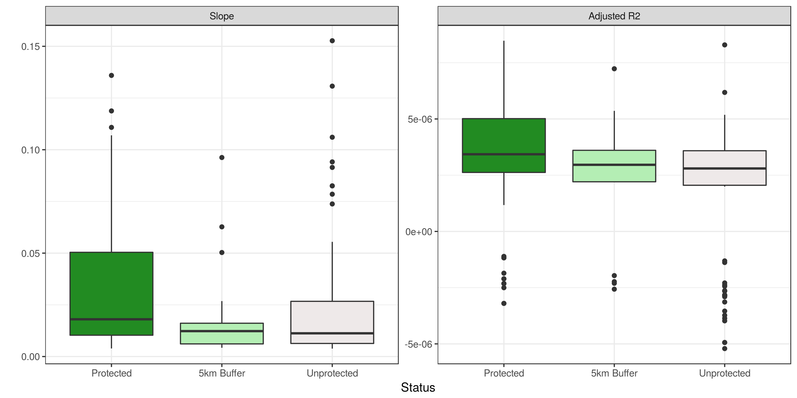 **Fig. 5.** Adjusted R2 and Slope of the GIMMS NDVI3g time series for each protection status (protected, unprotected and 5 km buffer zone of the study area in Botswana.

Overall, NDVI increased over the last 33 years (1981 - 2013) in each zone. The increase in NDVI was most pronounced and had a stronger fit in protected areas, compared to the buffer zone or unprotected areas (Fig. 5).

The mean percentage land cover of protected and non-protected areas during the time of the study showed that most protected areas are nearly entirely covered by savannas, apart from the Makgadikgadi Pans, which have an especially high proportion of woody savannas (17.6 %) and of barren or sparsely vegetated ground (4.4 %). The non-protected areas also have a lower coverage of savannas (86 %) and similar to the Makgadikgadi Pans have a higher proportion of woody savannas (8.3 %) and barren or sparsely vegetated areas (1.7 %) (Table 3).

**Table 3.** Percentage of land cover for protected and non-protected areas.

<table style="width:100%;">
<colgroup>
<col width="20%" />
<col width="5%" />
<col width="14%" />
<col width="5%" />
<col width="6%" />
<col width="7%" />
<col width="12%" />
<col width="17%" />
<col width="10%" />
</colgroup>
<thead>
<tr class="header">
<th align="center"> </th>
<th align="center">Chobe</th>
<th align="center">Makgadikgadi Pans</th>
<th align="center">Maun</th>
<th align="center">Moremi</th>
<th align="center">Nxai Pan</th>
<th align="center">Okavango Delta</th>
<th align="center">Okavango Delta System</th>
<th align="center">Non-protected</th>
</tr>
</thead>
<tbody>
<tr class="odd">
<td align="center">Barren or sparsely vegetated</td>
<td align="center">-</td>
<td align="center">4</td>
<td align="center">-</td>
<td align="center">-</td>
<td align="center">0.05</td>
<td align="center">-</td>
<td align="center">-</td>
<td align="center">2</td>
</tr>
<tr class="even">
<td align="center">Closed shrublands</td>
<td align="center">-</td>
<td align="center">-</td>
<td align="center">-</td>
<td align="center">-</td>
<td align="center">-</td>
<td align="center">-</td>
<td align="center">-</td>
<td align="center">0</td>
</tr>
<tr class="odd">
<td align="center">Cropland/Natural vegetation mosaic</td>
<td align="center">-</td>
<td align="center">1</td>
<td align="center">-</td>
<td align="center">-</td>
<td align="center">0.09</td>
<td align="center">-</td>
<td align="center">-</td>
<td align="center">0.6</td>
</tr>
<tr class="even">
<td align="center">Croplands</td>
<td align="center">-</td>
<td align="center">1</td>
<td align="center">-</td>
<td align="center">0.01</td>
<td align="center">0.08</td>
<td align="center">0.01</td>
<td align="center">0</td>
<td align="center">0.3</td>
</tr>
<tr class="odd">
<td align="center">Grasslands</td>
<td align="center">0.2</td>
<td align="center">2</td>
<td align="center">-</td>
<td align="center">3</td>
<td align="center">0.1</td>
<td align="center">2</td>
<td align="center">0.9</td>
<td align="center">0.3</td>
</tr>
<tr class="even">
<td align="center">Open shrublands</td>
<td align="center">-</td>
<td align="center">0.4</td>
<td align="center">-</td>
<td align="center">-</td>
<td align="center">-</td>
<td align="center">0.01</td>
<td align="center">0</td>
<td align="center">0.6</td>
</tr>
<tr class="odd">
<td align="center">Permanent wetlands</td>
<td align="center">-</td>
<td align="center">1</td>
<td align="center">-</td>
<td align="center">0.5</td>
<td align="center">0.09</td>
<td align="center">0.3</td>
<td align="center">0.1</td>
<td align="center">0.2</td>
</tr>
<tr class="even">
<td align="center">Savannas</td>
<td align="center">98</td>
<td align="center">69</td>
<td align="center">96</td>
<td align="center">95</td>
<td align="center">95</td>
<td align="center">97</td>
<td align="center">98</td>
<td align="center">86</td>
</tr>
<tr class="odd">
<td align="center">Snow and ice</td>
<td align="center">-</td>
<td align="center">2</td>
<td align="center">-</td>
<td align="center">-</td>
<td align="center">0.06</td>
<td align="center">-</td>
<td align="center">-</td>
<td align="center">1</td>
</tr>
<tr class="even">
<td align="center">Urban and built-up</td>
<td align="center">-</td>
<td align="center">1</td>
<td align="center">4</td>
<td align="center">-</td>
<td align="center">0.09</td>
<td align="center">-</td>
<td align="center">0.1</td>
<td align="center">0.6</td>
</tr>
<tr class="odd">
<td align="center">Woody savannas</td>
<td align="center">2</td>
<td align="center">18</td>
<td align="center">0.07</td>
<td align="center">1</td>
<td align="center">4</td>
<td align="center">0.7</td>
<td align="center">0.4</td>
<td align="center">8</td>
</tr>
</tbody>
</table>

### Migratory patterns

In total, zebras were tracked for 1630 days. Tracking duration varied between 72 - 364 days for each individual and on average zebras were tracked for 233 days. Total tracking distance varied between 1124 - 4087 km and on average zebras travelled 2878.40 km (± 1014.34 SD) (Table 1). The mean movement rate per zebra varied from 0.13 - 0.19 m/s. Mean step length was 394.82 m (± 60.45 SD) and mean direction varied between 2.2 and 6.8°.

All of the seven plains zebras migrated from the Okavango Delta in the northwest to the Makgadikgadi grasslands in the southeast of Botswana (Fig 6). From June until October they resided in the north-western part of the study area, in October/November they migrated to the Makgadikgadi Pans, where they stayed until April/May when they started moving back to the Okavango Delta (Fig. S8).

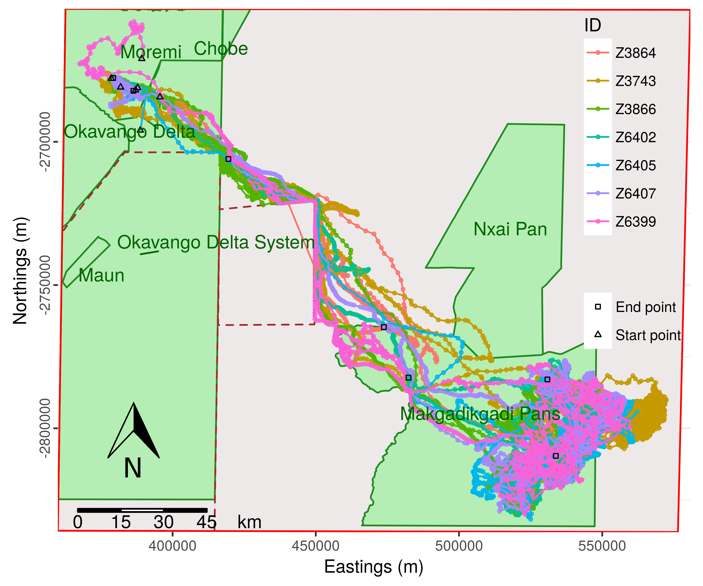 **Fig. 6.** Map of study area in Botswana with movement tracks colour-coded by individual. Protected areas are depicted in lightgreen and their name is stated. Dashed brown line indicates pathway of fence running through the study area.

All individuals migrated south, but one zebra (Z3864) was not tracked for long enough to record its northwards migration. Southern migration started around the beginning of November and lasted for 10 - 36 days. The average southern migration distance was 443.65 km. The start of the northern migration varied among invidiuals and years. In 2008 one individual started to migrate on the 10th of May and took 11 days, the other individual started no the 9th of March and took 84 days. In 2009, one individual started at the beginning of March and three individuals at the end of March and lasted for 20 - 61 days. Mean northern migration distance was 555.56 km (Table 4).

**Table 4.** Summary of migration (direction, start and end date and duration) for each individual.

<table>
<colgroup>
<col width="8%" />
<col width="16%" />
<col width="17%" />
<col width="14%" />
<col width="24%" />
<col width="20%" />
</colgroup>
<thead>
<tr class="header">
<th align="center">ID</th>
<th align="center">Direction</th>
<th align="center">Start Date</th>
<th align="center">End Date</th>
<th align="center">Duration (days)</th>
<th align="center">Distance (km)</th>
</tr>
</thead>
<tbody>
<tr class="odd">
<td align="center">Z3864</td>
<td align="center">South</td>
<td align="center">2007-10-25</td>
<td align="center">2007-11-30</td>
<td align="center">36</td>
<td align="center">695.1</td>
</tr>
<tr class="even">
<td align="center">Z3743</td>
<td align="center">South</td>
<td align="center">2007-10-30</td>
<td align="center">2007-11-25</td>
<td align="center">26</td>
<td align="center">760.6</td>
</tr>
<tr class="odd">
<td align="center">Z3866</td>
<td align="center">South</td>
<td align="center">2007-11-01</td>
<td align="center">2007-11-30</td>
<td align="center">29</td>
<td align="center">485.4</td>
</tr>
<tr class="even">
<td align="center">Z6402</td>
<td align="center">South</td>
<td align="center">2008-11-05</td>
<td align="center">2008-11-20</td>
<td align="center">14</td>
<td align="center">322.5</td>
</tr>
<tr class="odd">
<td align="center">Z6405</td>
<td align="center">South</td>
<td align="center">2008-11-05</td>
<td align="center">2008-11-15</td>
<td align="center">10</td>
<td align="center">239.3</td>
</tr>
<tr class="even">
<td align="center">Z6407</td>
<td align="center">South</td>
<td align="center">2008-11-05</td>
<td align="center">2008-11-16</td>
<td align="center">11</td>
<td align="center">297.4</td>
</tr>
<tr class="odd">
<td align="center">Z6399</td>
<td align="center">South</td>
<td align="center">2008-11-01</td>
<td align="center">2008-11-16</td>
<td align="center">15</td>
<td align="center">305.2</td>
</tr>
<tr class="even">
<td align="center">Z3684</td>
<td align="center">North</td>
<td align="center">-</td>
<td align="center">-</td>
<td align="center">-</td>
<td align="center">-</td>
</tr>
<tr class="odd">
<td align="center">Z3743</td>
<td align="center">North</td>
<td align="center">2008-05-10</td>
<td align="center">2008-05-21</td>
<td align="center">11</td>
<td align="center">224.2</td>
</tr>
<tr class="even">
<td align="center">Z3866</td>
<td align="center">North</td>
<td align="center">2008-03-09</td>
<td align="center">2008-05-31</td>
<td align="center">84</td>
<td align="center">1047</td>
</tr>
<tr class="odd">
<td align="center">Z6402</td>
<td align="center">North</td>
<td align="center">2009-03-31</td>
<td align="center">2009-04-20</td>
<td align="center">20</td>
<td align="center">214</td>
</tr>
<tr class="even">
<td align="center">Z6405</td>
<td align="center">North</td>
<td align="center">2009-03-01</td>
<td align="center">2009-03-25</td>
<td align="center">24</td>
<td align="center">303.8</td>
</tr>
<tr class="odd">
<td align="center">Z6407</td>
<td align="center">North</td>
<td align="center">2009-03-26</td>
<td align="center">2009-05-25</td>
<td align="center">60</td>
<td align="center">745.4</td>
</tr>
<tr class="even">
<td align="center">Z6399</td>
<td align="center">North</td>
<td align="center">2009-03-29</td>
<td align="center">2009-05-29</td>
<td align="center">61</td>
<td align="center">799.1</td>
</tr>
</tbody>
</table>

Average movement rate was higher during migration (0.22 m/s ± 0.28 SD) compared to residency times (0.13 m/s ± 0.18 SD), while mean absolute turning angle was lower during migration (55.24° ± 51.30 SD) compared to residency times (60.71° ± 50.91 SD) (Fig. 7).

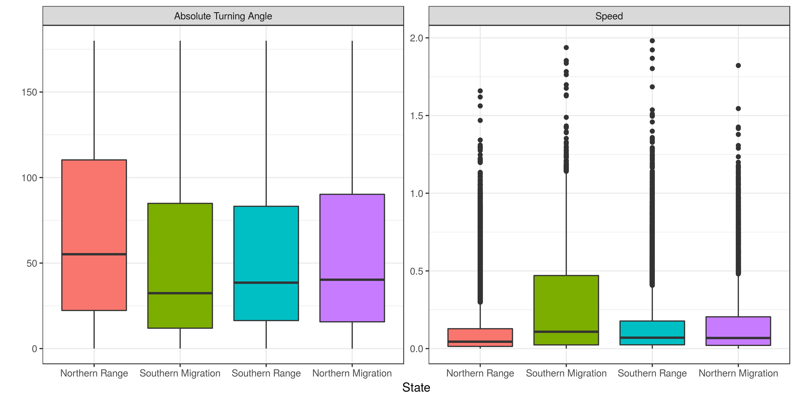 **Fig. 7.** Absolute turning angle (°) and speed (m/s) for each migration state (Northern Range, Southern Migration, Southern Range and Northern Migration).

Zebras experienced a distinctive difference in altitude throughout their migration (Fig. 8). In their northern range zebras exprienced a mean altitude of 944.69 m (± 4.88 SD), while in their southern range zebras experienced an elevation of 906.58 m (± 4.56 SD).

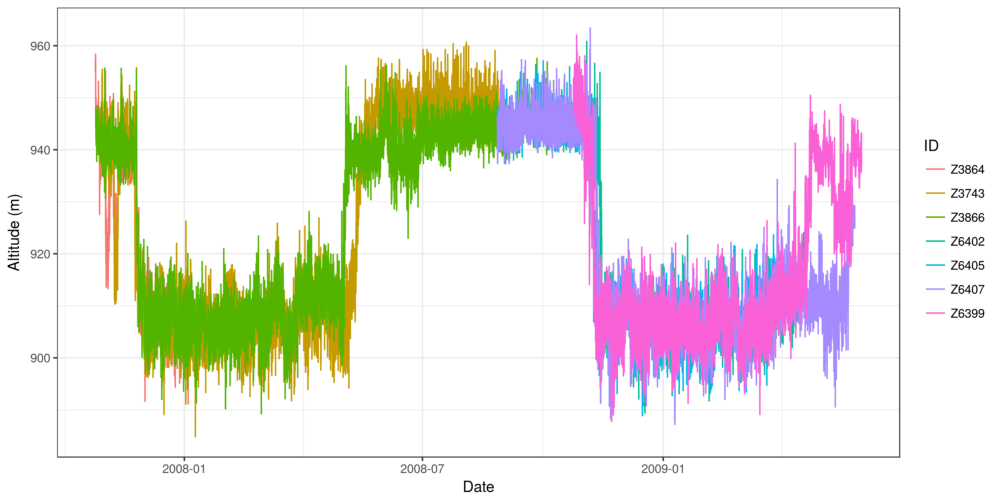 **Fig. 8.** Altitude over time experienced by each individual zebra in Botswana.

During migration and residence in the Makgadikgadi Pans zebras experienced a lower NDVI compared to their residence in the Okavango Delta (Fig. 9).

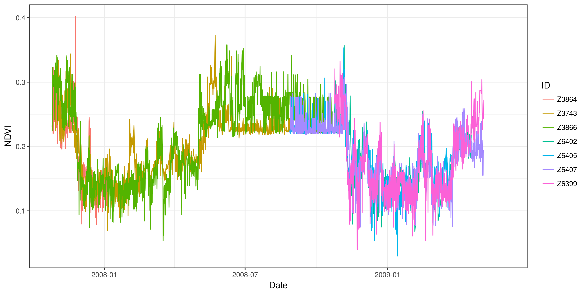 **Fig. 9.** NDVI over time experienced by each individual zebra in Botswana.

### Zebra habitat selection

Most of the 28 potential explanatory variables were highly correlated among each other. NDVI and EVI obtained from MODIS MOD13Q1 and MYD13Q1 products (NDVI and EVI) were correlated with the NDVI and EVI derived from MODIS MOD09A1 and MYD09A1 surface reflectance layers (ndvi and evi). Apart from Landsat ndwimcf none of the Landsat indices was correlated with lower resolution indices. Slope, aspect, distance to goal, brightness and Landsat derived EVI (LSevi) were the only variables that were not correlated with any other variable (Fig. S11).

In total, there were 19 different combinations of uncorrelated explanatory variables, which were used as initial models (Table S3).

The best model (lowest AIC) varied among individals. M2 was the best model for Z3743, Z6405 & Z6407. M3 was the best model for Z3866, M8 the best model for Z6402 & Z6399 and M15 the best model for Z3864. Overall, the best model was M2. M2 included 9 explanatory variables (aspect, aweins, brightness, goal, LSevi, LSndmi, LSndvi, ndmi, ndvi and slope) (Table S4).

Aspect and LSevi were removed through stepwise backward selection for every individual. LSndvi and ndvi showed a significant effect across all individual models (n=7). Brightness was significant for all but one individual and aweins was significant for 5 individuals. The remaining variables were significant for only some individuals (Table 5).

**Table 5.** p-Values for each component of the final model and each individual.

<table>
<colgroup>
<col width="19%" />
<col width="10%" />
<col width="11%" />
<col width="11%" />
<col width="11%" />
<col width="11%" />
<col width="11%" />
<col width="11%" />
</colgroup>
<thead>
<tr class="header">
<th align="center">Variable</th>
<th align="center">Z3864</th>
<th align="center">Z3743</th>
<th align="center">Z3866</th>
<th align="center">Z6402</th>
<th align="center">Z6405</th>
<th align="center">Z6407</th>
<th align="center">Z6399</th>
</tr>
</thead>
<tbody>
<tr class="odd">
<td align="center">cos(rel.angle)</td>
<td align="center">0</td>
<td align="center">0</td>
<td align="center">0</td>
<td align="center">0</td>
<td align="center">0</td>
<td align="center">0</td>
<td align="center">0</td>
</tr>
<tr class="even">
<td align="center">brightness</td>
<td align="center">0.00227</td>
<td align="center">0</td>
<td align="center">9.7e-06</td>
<td align="center">0.00163</td>
<td align="center">0.0115</td>
<td align="center">0</td>
<td align="center">-</td>
</tr>
<tr class="odd">
<td align="center">LS_ndvi</td>
<td align="center">1.6e-07</td>
<td align="center">0.000792</td>
<td align="center">5.77e-15</td>
<td align="center">4.43e-07</td>
<td align="center">1.42e-05</td>
<td align="center">3.43e-06</td>
<td align="center">8.84e-13</td>
</tr>
<tr class="even">
<td align="center">ndvi</td>
<td align="center">0.0112</td>
<td align="center">0</td>
<td align="center">0</td>
<td align="center">5.52e-11</td>
<td align="center">0</td>
<td align="center">0</td>
<td align="center">6.54e-11</td>
</tr>
<tr class="odd">
<td align="center">awei_ns</td>
<td align="center">-</td>
<td align="center">0</td>
<td align="center">6.66e-16</td>
<td align="center">8.37e-07</td>
<td align="center">0.000781</td>
<td align="center">0</td>
<td align="center">-</td>
</tr>
<tr class="even">
<td align="center">slope</td>
<td align="center">-</td>
<td align="center">0.0484</td>
<td align="center">-</td>
<td align="center">6.33e-05</td>
<td align="center">-</td>
<td align="center">-</td>
<td align="center">-</td>
</tr>
<tr class="odd">
<td align="center">goal</td>
<td align="center">-</td>
<td align="center">-</td>
<td align="center">7.8e-10</td>
<td align="center">-</td>
<td align="center">-</td>
<td align="center">0.0191</td>
<td align="center">-</td>
</tr>
<tr class="even">
<td align="center">LS_ndmi</td>
<td align="center">-</td>
<td align="center">-</td>
<td align="center">0.000235</td>
<td align="center">0.00111</td>
<td align="center">-</td>
<td align="center">0.00135</td>
<td align="center">1.07e-06</td>
</tr>
<tr class="odd">
<td align="center">ndmi</td>
<td align="center">-</td>
<td align="center">-</td>
<td align="center">-</td>
<td align="center">-</td>
<td align="center">3.24e-05</td>
<td align="center">-</td>
<td align="center">1.03e-08</td>
</tr>
</tbody>
</table>

Discussion
----------

Africa's rapidly growing population leads to increasing agricultural production and mineral exports. Several development corridors have been proposed in sub-Saharan Africa to expand infrastructure, such as roads, railroads, pipelines and port facilities, and so increase the access to new land. As a consequence the environment is being altered at an explosive rate, which severely degrades African ecosystems and wildlife (Laurance et al. 2015).

There was a significant increase in NDVI, which is a proxy for vegetation, in some parts of the study area from 1981 to 2013. But, the increase in NDVI was very low, which indicates a more or less steady-state in long-term vegetation trends (Fig. 3).

The majority of the study area was covered by savannas (Table ). Savannas have been used by humans for many centuries, but intensive cattle production and arid-land farming has put increasing pressure on this ecosystem in recent years. This has led to soil erosion and desertification and threatens endangered species, such as elephants and rhinos (Young et al. 1997). Savannas are among the ecosystems that are most sensitive to future land use and climate change (Knegt et al. 2008). From 2001 to 2013 a slight decrease in savanna and an increase in open shrublands was observed (Figs. and S5). This could be due to an increas in land use in the area. Land use in Ngamiland strongly depends on the availability of water, soil and rangeland quality, the distribution of wildlife, the occurrence of plants poisonous to cattle and in the past also on the presence of vector-borne diseases (Kgathi et al. 2014).

More than half of the study area was covered by PAs. PAs are the key tool for protecting biodiversity, but not all PAs are effective and they can have negative impacts on local communities (Oldekop et al. 2015). For example, the Moremi Game Reserve, the oldest PA within our study area, led to the removal and resettlement of indigenous communities that historically inhabited the area (Kgathi et al. 2014). Game reserves and national parks account for 6.4 % of the tribal land in Ngamiland, including Moremi Game Reserve and Nxai Pan National Park. While national parks protect the land and its natural resources, game reserves legally only protect the animals and not the land. However, in practice game reserves are given the same treatment as national parks in Botswana (Kgathi et al. 2014). Global spatial data on protected area coverage, such as the WDPA, can suffer from spatial inaccuracies and lack sufficient spatial and thematic detail for effective monitoring of single protected areas or even regional park networks (Chape et al. 2005, Nagendra et al. 2013).

The areas with the highest increase in vegetation were found within Makgadikadi Pans Nationalpark (Fig. 3). NDVI also showed a higher increase and stronger fit in protected areas, compared to the buffer zone or unprotected areas (Fig. 5). This indicates that the protected areas are indeed effective in conserving the ecosystems within them. AVHRR long-term time series provide a unique possibility to monitor land-cover dynamics of PAs (Wegmann et al. 2014), but the resolution of AVHRR is coarse. Semi-arid savannas show patchy distributions at the meter scale (Kgathi et al. 2014), so most dynamics in savannas have probably been overlooked.

Plains zebras can be sedentary or migratory. Sedentary populations typically have a high density and small home range, while migratory populations have low densities. Unfortunately, only data from migratory plains zebras in this region was available.

Zebras migrated from the southeastern Okavango Delta to the Makgadikgadi grasslands (Figs. and S9). Southern migration started around the beginning of November, which corresponds to the results of Bartlam-Brooks et al. (2013), who found that migration started between 27th October and 5th November, while northern migration was from end of March till the end of May.

Zebras stayed at the Makgadikgadi grasslands only during the wet season, as then the grasslands are hospitable to them and water is temporarily available. NDVI was higher in the Okavango Delta both in the dry and wet season (Fig. S6) and zebras experienced a lower NDVI in the Makgadikgadi grasslands compared to the Okavango Delta (Fig. ). This explains, why the majority of zebras do not migrate, but reside in the Okavango Delta permanently (Bartlam-Brooks et al. 2013). It also indicates that the migration is not driven by seasonal resource limitation, but rather by the high nutritional value of the Makgadikgadi grasslands (Baillieul 1979).

The Okavango Delta is much higher in altitude than the Makgadikgadi Pans (Fig. S2). This is also reflected in the altitude the zebras experienced over time (Fig. ). This suggests that it would be possible to classify our animal trajectories based on changes in habitat use (altitude), which has been recently proposed by Toor et al. (2016).

The average migration distance was 495.3 km (Table 4). However, we calculated the total distance moved by the animal rather than just the overall distance between start and end location of the migration. The overall distance between the Okavango Delta and the Makgadikgadi Pans is approximately 250 km, which corresponds to the migration distance found in the literature (Bartlam-Brooks et al. 2013).

Zebras generally moved faster and with a lower turning angle during migration compared to residency times (Fig. ). Bartlam-Brooks et al. (2013) found that zebras decrease their migration speed with increasing NDVI and that they can even adapt their time of arrival at the migration destination according to the peak in NDVI. Arrival timing at breeding sites determines the reproductive success of an individual and so influences population and ecosystem dynamics, which has implications for management and conservation (Tibblin et al. 2016).

Movement data derived from GPS collars can contain two types of errors, missing location fixes and location errors of successful acquired fixes (Bjørneraas et al. 2010). Location errors can occur when the accuracy of fixes does not provide a correspondingly accurate measure of the animal’s natural behavior. Brooks et al. (2008) studied the effect of collar weight and fit on the rate of travel of female plains zebras in the Makgadikgadi Pans. Collar effect was activity specific and less pronounced when animals cross large interpatch distances, for example during migration, but strongly interfered with grazing behaviour. Heavier collars (0.6 % of total body mass) reduced the rate of travel by more than 50 % when foraging compared with the collar that was 0.4 % of the total body mass. The collars which were used to derive the movement data of this study weighed &lt; 0.3 % of the total body weight (Bartlam-Brooks et al. 2013), and so are unlikely to have an effect.

The migratory route of all zebras ran closely along the fence, which is running through parts of the study area (Fig. ). This suggests that the migration of zebras, similar to African buffalo and African savannah elephant (Loarie et al. 2009), is affected by the presence of barriers. From 1968 - 2004 the migration of plains zebras was blocked completely by a fence, but within 3 years the original migration route was re-established (Bartlam-Brooks et al. 2011). Many fences have been erected in the area, mostly to prevent the spread of food and mouth disease from wildlife to cattle. These fences resulted in the entanglement and killing of many animals, as they were often erected across established wildlife migratory routes (Perkins 1996, Kgathi et al. 2014). Digital maps of barriers, such as fences, human settlements or agricultural areas, can be derived from land cover data and aerial photos, but this has been rarely done in the past (Neumann et al. 2015).

Migration routes followed a narrow corridor (Fig. ), indicating that zebras follow along a traditional route, which would indicate a migration corridor (Berger 2004). However, most individuals were tracked for less than one year, so it is not clear if zebras follow the same route over multiple years or if it is resource driven. Only the north-western and south-eastern part of the study area are protected, but the migration corridor, which would connect the two areas, is not (Fig. ). Traditional conservation efforts have often focused on protecting seasonal ranges, but have less often considered migration corridors. A more detailed understanding of the drivers of migration pathways will help us to protect the migration of zebras in the future.

Migratory animals have large area requirements and so are much more likely to be affected by modifications of the natural landscape, due to climate or land use change, than non-migratory species (Berger 2004, Bolger et al. 2008, Wilcove and Wikelski 2008). Habitat selection can influence the survival and life-time reproductive success of individuals (Mäkeläinen et al. 2016). Hence, it is particularly important to understand the drivers of animal migrations in order to conserve them.

RSFs are commonly used to quantify habitat selection, by comparing habitat attributes in sites used by the animals compared to unused, but available sites. We took the extent of our movement data plus a 5 % buffer as available habitat (Fig. ). Defining areas as available habitat implies that animals know about this availabiilty and move accordingly. The way of defining available habitat, thus criticially alters the results (Freitas et al. 2008).

Using spatio-temporal environmental information to model animal movement can help to identify decision rules, orientation and navigation mechanisms, as well as the effects of environmental heterogeneity (Bartlam-Brooks et al. 2013). In this study, spatio-temporal information from 11 different indices with various resolutions (30, 250 and 500 m) and terrain data (altitude, aspect and slope) were considered (Fig. S2). Previous studies have often used vegetation phenology data (NDVI) from multiple dates. Sometimes they were combined with climate, weather and terrain data, but rarely multiple indices have been considered (Neumann et al. 2015).

Most of the indices were highly correlated among each other (Fig. S11). As was previously shown, NDMI is correlated with wetness (Jin and Sader 2005) and greenness is highly correlated with EVI (Zhang et al. 2002). Spatial autocorrelation is inherent in any form of animal movement data (Fleming et al. 2015). The autocorrelation of our data was assessed using variograms (Fig. S6) and our data was split in three hour intervals to overcome this effect. Some spatial autocorrelation might still have been present in the data underlying our models, which could have been removed by coarsening our data even more. But, coarsening the data introduces a strong bias, as only the use of a location, but not the amount of time an individual spends at this location is taken into account (Lele et al. 2013).

SSFs showed that LSndvi and ndvi were a significant driver in habitat use for each individual. Brightness, aweins, LSndmi, ndmi and slope were also significant for some individuals (Table 5). This confirms that slope and access to water can constrain grazing use of some areas, as has been shown previously (Bailey et al. 1996), but also again highlights the utility of NDVI as proxy for vegetation patterning (Pettorelli et al. 2011). NDVI does not only influence migration distance (Teitelbaum et al. 2015), but can also be used to trace step-wise habitat choices of single individuals. Global long-term changes in NDVI may thus force animals to alter the distance, timing and route of their migrations.

Landsat imagery added another source of environmental information in addition to MODIS data and vice versa. This highlights the importance of Landsat imagery for monitoring vegetation structure and habitat changes on a regional level (Nagendra et al. 2013, Willis 2015), but also shows the importance of medium resolution data to depict large scale vegetation patterns. Coarse and medium resolution data might provide daily observations, but without a suitable spatial resolution for Global Positioning System (GPS) collar-based movement data. Very high resolution data (i.e. SPOT imagery) did not show substantial improvements over Landsat for land cover mapping in Botswana, as dry semi-arid vegetated areas tend to show a lack of near infrared reflectance (Kgathi et al. 2014).

RSFs are commonly used to quantify the habitat use of animal's from movement data in order to derive conservation corridors. But, if the animal's behavioural state is not considered, RSFs may lead to the misallocation of wildlife corridors (Abrahms et al. 2016). Memory is another often neglected factor that shapes animal movement patterns and SSFs that incorporate spatial memory can improve the estimates of habitat selection (Oliveira-Santos et al. 2016). In this study no model validation was applied, so the reliability of the outcome is questionable. Boyce et al. (2002) suggested to use k-fold cross validation for evaluating RSF model predictions, in particular for studies with one intensive period of data collection at one location.

Conservation of animal movement is challenging, as it often means putting large areas under protection and so in conflict with human use (Thirgood et al. 2004). Migratory species require adequate amounts of both breeding and non-breeding habitat to maintain viable populations and travel routes need to be free of barriers, so animals can move to and from breeding grounds.

Global habitat degradation and fragmentation calls for increasing attention to identify landscape features that support (corridors) or impede (barriers) animal movement (Panzacchi et al. 2016). Conservation corridors help to improve the connectivity of vegetation patches. Habitat connectivity allows species to extend their occurrence distribution, which helps to achieve population persistence, but the functional habitat connectivity will vary considerably among species (Barton et al. 2015).

Nevertheless, given the importance and high threat of migratory species, conservation actions need to be spatially prioiritised to fulfill the needs of migratory species (Barton et al. 2015). Some of the movement behaviours of ungulates have been identified in the past, while others are complex and difficult to protect with generic conservation solutions (Berger 2004, Wilcove and Wikelski 2008). This puts the partially protected and poorly understood ungulate populations under continued pressure (Olson et al. 2010).

Occurrence distribution and habitat use of Grevy’s and plains zebras
====================================================================

Abstract
--------

Ungulate populations are declining inside as well as outside protected areas across Africa. Protected areas often lack enforcement, which makes them highly ineffective and prone to land-use change. Small-scale daily movements of animals are likely to be affected by these changes and can influence predation rate or foraging success and so decrease their survival and reproduction capability. The movement of Grevy's and plains zebras was analysed by comparing their occurrence distributions, movement characteristics and habitat use. The effectiveness of protected areas and the protection coverage of zebra movement was further assessed. The entire study area experienced a significant increase in NDVI from 1981 - 2013 and an increase in savannas, woody savannas and cropland/natural vegetation mosaic was observed from 2011 - 2013. Grevy's zebras had a larger occurrence distribution than plains zebras, while plains zebras moved faster compared to Grevy's zebras. Overlap between occurrence distributions among the two species was low (27.23 %). The two species experienced different NDVI and EVI values per month, while both occurred at similar land cover. This shows that land cover is not as suitable as vegetation indices for detecting small-scale differences in resource use among species, however high resolution land-cover products might provide a suitable alternative. Laikipia is lacking areas which are formally protected and only 26 % of animal-defined corridors fell within PAs. In order to enhance animal movement conservation corridors should ideally be based on the habitat selection and movement of the organism.

**Keywords:** remote sensing, animal movement, protected areas, conservation, habitat use, land cover, autocorrelated kernel density estimation, plains zebras, Grevy's zebras, Laikipia, Kenya

Introduction
------------

In the past, research on animal movement has been primarily looking at the movement behaviour of individual animals (Nathan et al. 2008) and less at population level movement (Mueller et al. 2011). Studying the underlying mechanisms of the movement of individuals forms the baseline for understanding the population dynamics (Mueller and Fagan 2008). This is detrimental in order to predict the influence of anthropogenic environmental change on species' distribution and to come up with conservation strategies (Demšar et al. 2015).

Kenya currently has 23 terrestrial national parks and 26 nature reserves, which together cover 8 % of the total land surface. Kenya's PAs only cover parts of the migratory range of large herbivores and also vary in the protection of dry and wet season ranges of migratory species, such as wildebeest and zebra. Ungulate populations have been found to decline inside as well as outside of PAs across Africa and especially within Kenya, where there has been a sharp decline over the last 30 years (Western et al. 2009).

PAs are intended to conserve habitats and species, but the effectiveness of East African PAs varies among protection status (Pfeifer et al. 2012a) and size. Generally, small reserves are less efficient in conserving species than large ones. Faunal communities within reserves might experience species depletion if reserves are small in size or isolated from surrounding natural habitat (Miller and Harris 1977). In Kenya, larger parks lack enforcement and so are subject to land cover changes and poaching, which makes them highly ineffective in conserving ungulate species (Western et al. 2009). But, Hoffmann et al. (2015) found that if conservation efforts would have ceased in 1996 at least 148 species of the 235 recognized ungulate species in the world would have deteriorated by one IUCN Red List category compared to their status in 2008. Furthermore, six of these species would now be listed as extinct or extinct in the wild.

Not only migratory routes are influenced by anthropogenic environmental change, but also small-scale, daily movements can be affected by human infrastructure and land-use change (Panzacchi et al. 2016). The movement of an animal is driven by the suitability of an area for a particular activity, such as feeding, resting, mating, raising newborns and escaping predators (Panzacchi et al. 2016). Habitat loss can restrict the movement of an animal and so reduce its breeding and dispersal success as well as its predation rate or foraging success rate (Fahrig 2003) and so indirectly affects its survival and reproduction (Kerk et al. 2015). Thus, there is a strong interest in understanding the driving forces of animal space use and mitigating the effects of habitat fragmentation on animal movement for species' conservation (Sundaresan et al. 2008, Panzacchi et al. 2016).

Mammals in general are selective in their habitat use, while African savanna herbivores in particular track resources through space and time (Bailey et al. 1996). The distribution and abundance of large grazing mammals are influenced by the seasonal and spatial variation in forage quality and the negatively related vegetation productivity and precipitation (Breman and Wit 1983, McNaughton 1983, 1985). Grazers preferentially forage on mineral-enriched grasses, which are particularly important during late-stage pregnancy, lactation, and the growth of young animals (McNaughton 1988, McNaughton1990). Forage quality is also a better explanatory variable for mortality rates of African herbivores than resource abundance (Sinclair et al. 1985, Fryxell 1987). In African savannas, food availability changes with the season along a topograpical gradient. Non-migratory species tend to congregate on ridge tops in the wet season and as the dry season sets in, progressively move down the slopes (Jarman and Sinclair 1979). Slope and distance to water were found to constrain the grazing use of some areas (Bailey et al. 1996). Ungulates follow daily movement patterns between foraging sites and are usually active during most time of the day (Schweiger et al. 2015). Areas which are frequently visited by ungulates can be expected to contain important foraging resources. The movement of ungulates is not only driven by vegetation, but ungulates themselves are also major drivers of landscape dynamics (McNaughton 1979, McNaughton et al. 1997, Knegt et al. 2008, De Jager and Pastor 2009), which can be beneficial to themselves (Jones et al. 1994). Grazing of ungulate herbivores influences the spatial distribution of food, cover, productivity and soil fertility. Selective foraging by ungulates can further influence plant community composition and nutrient cycling (De Jager and Pastor 2009), which can contribute to plant regrowth potential (McNaughton 1983, Coughenour et al. 1985). Ungulates also affect the abundance and population dynamics of other species, ranging from herbivores (Coughenour 1991) to soil decomposers (Wardle et al. 2004), which again have an impact on vegetation composition and structure.

In this chapter, the occurrence distribution, movement characteristics and habitat use of Grevy's and plains zebras will be analysed and the effectiveness of current protection measures will be addressed by answering the following questions:

-   Has there been an increase or loss in vegetation over the last 30 years?
-   What is the space use of Grevy's and plains zebras?
-   How well do the current PAs cover the space use of the two species?

Materials and Methods
---------------------

### Study area

The study area was delineated by the extent of our movement data plus a 5 % margin. It lies in the Laikipia district, Kenya, north-west of Mount Kenya and covers an area of 4120 km2 (Fig. 10). The study area is situated at an altitude of 1192 - 2104 meters (Fig. S13). The area is characterised by a semi-arid climate (Fig. S12).

Monthly rainfall ranges from 23 mm in January to 128 mm in April. Total annual rainfall varies from 507 mm in the north to 1021 mm in the south. The mean annual rainfall of the study area is 680 mm (1960-1990, Hijmans et al. (2005)). The area usually experiences two rainy seasons (Fig. S12), which vary among years.

Rainfall is unpredictable in terms of onset, duration and termination. Increasing population size and growing demand for irrigation water has led to a significant decline in river water. Water availability is the most limiting factor for agriculture and climate models predict an increase in variability of inter- and intra-annual precipitation for the future (Ulrich et al. 2012).

Laikipia district is part of the Greater Ewaso ecosystem, a typical semi-arid savanna, which is broadly defined by the watershed of the Ewaso Ngiro River. It is largely unfenced, contains only 2 % of formally protected areas and consists to 39 % of commercial cattle ranches, 34 % of smallholder plots, 8.5 % government owned land, 7 % group ranches, 7 % forest reserves and 4.5 % urban areas (Georgiadis et al. 2003, Sundaresan et al. 2012, Evans and Adams 2016). The Laikipia district has a population density of 35 persons per km2 (Ayeri et al. 2012).

Most of the land is used for large commercial livestock ranches (Sundaresan et al. 2008, 2012) and so the majority of the area consists of undeveloped habitat. The provision of water from livestock dams within ranches supports large mammal communities. As a result, Laikipia hosts the only intact savanna mammal community outside a Kenyan national park and contains the second highest abundance of wildlife in Kenya, after Maasai Mara National Reserve (Evans and Adams 2016). Seventy-five mammal species and 400 bird species can be found in the region (Shorrocks and Bates 2014).

<!-- Look at [@Young1997] for description on soils. -->
### Grevy's and plains zebras

The grevy's zebra is a large-bodied (350 - 450 kg) grazing ungulate. It is the largest of the three *Equid* species. Once, the species ranged widely across the savannas of northern Kenya, Ethiopia and Somalia. Grevy's zebras have undergone a population decline of 75 % since the 1970s and currently only around 2500 individuals remain in northern Kenya and Ethiopia. Thus, they are listed as "Endangered" under the IUCN Red List of Species (Moehlman et al. 2013). Reasons for the population declined are habitat degradation, reduced access to waterholes and illegal killing (Moehlman 2002). The last stronghold of Grevy's zebra is the Ewaso ecosystem in the Laikipia and Samburu districts of northern Kenya. They expanded their range into Laikipia in the beginning of the 1970s, but in this area their ecology has hardly been studied. In Laikipia, the population has grown during the last 12 years, while other parts of their range were lost. Speculated reasons for the population increase are better survival or increased immigration from other areas (Moehlman 2002, Sundaresan et al. 2008, 2012).

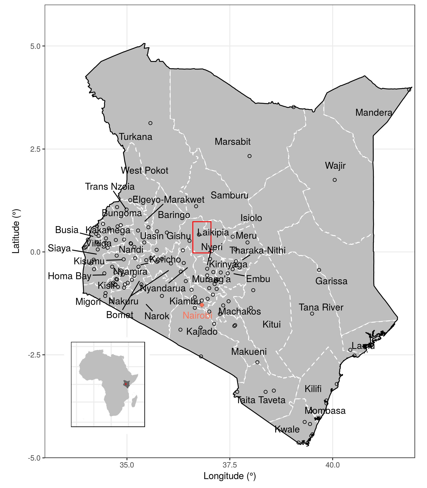

**Fig. 10.** Map of Kenya with the study area highlighted in red. District boundaries are shown by white dashed lines. The location of all cities with a population of more than 40000 people is shown and capital city is highlighted in orange. Administrative boundaries were obtained from <http://www.gadm.org> using the `raster` package (Bivand et al. 2016). Locations of cities were obtained from the `maps` package (Becker et al. 2016).

Grevy's zebras live on rangelands often shared by pastoral populations and are uniquely adapted to its arid environment. Generally, they can survive on low quality grass forage and go for several days without drinking. Females form unstable groups, moving among male territories, while bachelors wander. Depending on the reproductive state the forage quality and quantity and habitat openness of locations used varies significantly (Sundaresan et al. 2008). Lactating females must visit water daily (Sundaresan et al. 2012), which results in partial segregation among females by reproductive state (Sundaresan et al. 2007). Lactating females, as well as bachelors, further prefer areas with green, short grass and medium-dense bush, which suggests that they need to access certain nutrients (Sundaresan et al. 2008).

In Laikipia, Grevy's zebra co-occur with the closely related and more abundant plains zebra (Sundaresan et al. 2012). A detailed description of the plains zebra can be found in the preceeding chapter. They occur in more mesic areas than the other African equids, where water is available, in light woodland, open scrub, grassland, dambos and occasionally broken, hilly ground. Plains zebras show a preference for *Acacia* rather than *Commiphora* woodlands (Grubb 1981). Fischhoff et al. (2007a) further found that plains zebras use more woodland habitat at night and if they use grassland they take sharper turns in order to avoid predation from lions. A modelling study on plains zebras in Laikipia district showed that population decline is faster during dry phases than recovery during wet phases and that they are particularly vulnerable to large variation in annual rainfall (Georgiadis et al. 2003).

### Movement Data

Movement data of seven Grevy's zebras and two plains zebras was obtained from Movebank. Additional data from four adult plains zebras (females in 3 harems and 1 bachelor male) was provided by Ilya Fichhoff (Fischhoff et al. 2007a) (Fig. 11).

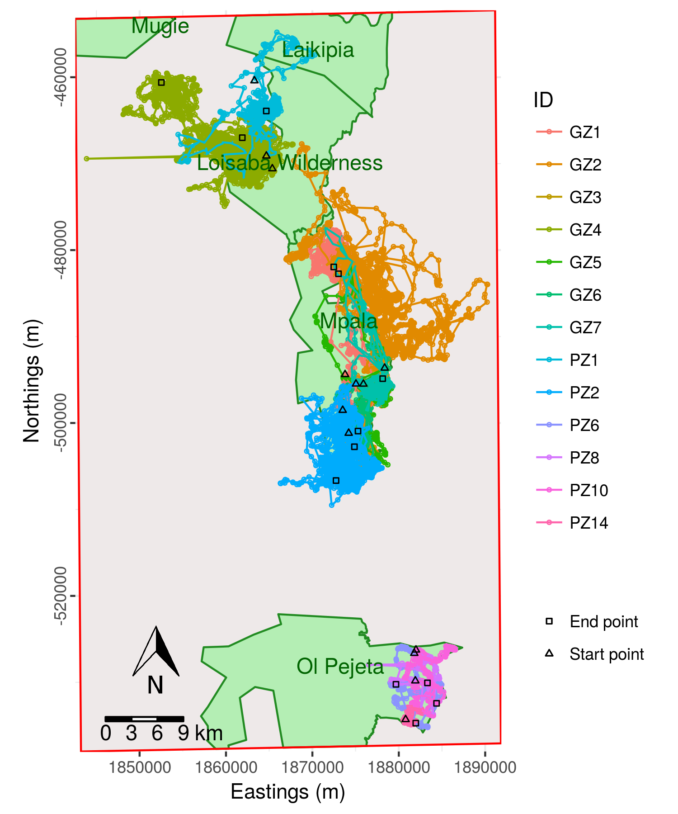

**Fig. 11.** Laikipia zebra movement tracks\]{Map of study area with movement tracks colour-coded by individual. Protected areas are depicted in lightgreen.

The nine zebras from Movebank were tagged in June and July 2007 and their position was recorded every hour. The four additional plains zebras have been tracked every 8 minutes from the end of June until the beginning of July 2005. Altogether the dataset contained 37771 point locations from 13 different individuals (7 Grevy's and 6 plains zebras) and covered a total time span of 5 months (Table 6).

**Table 6.** Start and end date of the tracking period, tracking duration (days), total distance (km) and median time interval (min) of each individual zebra.

<table>
<colgroup>
<col width="5%" />
<col width="15%" />
<col width="13%" />
<col width="21%" />
<col width="19%" />
<col width="25%" />
</colgroup>
<thead>
<tr class="header">
<th align="center">ID</th>
<th align="center">Start date</th>
<th align="center">End date</th>
<th align="center">Duration (days)</th>
<th align="center">Distance (km)</th>
<th align="center">Time interval (min)</th>
</tr>
</thead>
<tbody>
<tr class="odd">
<td align="center">GZ1</td>
<td align="center">2007-06-13</td>
<td align="center">2007-09-09</td>
<td align="center">87.93</td>
<td align="center">617.6</td>
<td align="center">60</td>
</tr>
<tr class="even">
<td align="center">GZ2</td>
<td align="center">2007-06-13</td>
<td align="center">2008-01-04</td>
<td align="center">204.6</td>
<td align="center">1741</td>
<td align="center">60</td>
</tr>
<tr class="odd">
<td align="center">GZ3</td>
<td align="center">2007-06-14</td>
<td align="center">2007-09-19</td>
<td align="center">97.05</td>
<td align="center">948.2</td>
<td align="center">60</td>
</tr>
<tr class="even">
<td align="center">GZ4</td>
<td align="center">2007-06-14</td>
<td align="center">2008-06-10</td>
<td align="center">361.6</td>
<td align="center">3450</td>
<td align="center">60</td>
</tr>
<tr class="odd">
<td align="center">GZ5</td>
<td align="center">2007-07-09</td>
<td align="center">2007-08-11</td>
<td align="center">32.54</td>
<td align="center">194</td>
<td align="center">60</td>
</tr>
<tr class="even">
<td align="center">GZ6</td>
<td align="center">2007-06-16</td>
<td align="center">2007-07-23</td>
<td align="center">36.79</td>
<td align="center">290.9</td>
<td align="center">60</td>
</tr>
<tr class="odd">
<td align="center">GZ7</td>
<td align="center">2007-06-16</td>
<td align="center">2007-10-25</td>
<td align="center">131.2</td>
<td align="center">789.3</td>
<td align="center">60</td>
</tr>
<tr class="even">
<td align="center">PZ1</td>
<td align="center">2007-06-14</td>
<td align="center">2007-07-09</td>
<td align="center">24.82</td>
<td align="center">247.2</td>
<td align="center">60</td>
</tr>
<tr class="odd">
<td align="center">PZ2</td>
<td align="center">2007-06-17</td>
<td align="center">2007-12-08</td>
<td align="center">173.9</td>
<td align="center">1578</td>
<td align="center">60</td>
</tr>
<tr class="even">
<td align="center">PZ6</td>
<td align="center">2005-06-24</td>
<td align="center">2005-07-02</td>
<td align="center">7.933</td>
<td align="center">113.6</td>
<td align="center">8</td>
</tr>
<tr class="odd">
<td align="center">PZ8</td>
<td align="center">2005-06-24</td>
<td align="center">2005-07-08</td>
<td align="center">13.83</td>
<td align="center">84.68</td>
<td align="center">8</td>
</tr>
<tr class="even">
<td align="center">PZ10</td>
<td align="center">2005-06-24</td>
<td align="center">2005-07-04</td>
<td align="center">9.917</td>
<td align="center">105</td>
<td align="center">8</td>
</tr>
<tr class="odd">
<td align="center">PZ14</td>
<td align="center">2005-06-24</td>
<td align="center">2005-06-27</td>
<td align="center">3.019</td>
<td align="center">41.55</td>
<td align="center">8</td>
</tr>
</tbody>
</table>

### Environmental Data

GIMMS NDVI3g data was again used to assess the trend in NDVI for each pixel within our study area (Fig. 12), for a detailed description on the methodology see Chapter 1. The spatial extent of all protected areas within the study area was accessed through the World Database on Protected Areas (WDPA) at <http://protectedplanet.net>. Based on the PA boundary, three zones were differentiated: Protected, 5km Buffer (area outside a PA but less than 5 km from the PA boundary) and Unprotected (Fig. S4) and the trend in NDVI was compared for these three zones (Fig. 14).

MODIS MOD09A1 and MYD09A1 surface reflectance layers were used to calculate NDVI, EVI with a temporal resolution of 4 days and a spatial resolution of 500 m for the course of the study, using the following equations (Eqs. 1 & 2).

The annual MODIS Land Cover Type (MCD12Q1 V006) product at a resolution of 500 m was obtained for the entire study area and time span that it is available (2001 - 2013) (Fig. S16). The International Geosphere Biosphere Programme (IGBP) scheme was used, which provides 17 different land cover classes. It is derived through supervised decision-tree classifications using 1370 training sites and has a global accuracy of 75 % (Cohen et al. 2006). In addition, a land use map of Laikipia district, with 14 different land use classes, was obtained from Laikipia Wildlife Forum and cropped by the extent of the study area (Fig. S15).

### Movement Analysis

Movement data was cleaned by removing one duplicated data point, which was completely identical to the preceeding one.

<!-- Movement data was categorised into seasons (Fig. \ref{fig:zebra_season_ken}). Seasons were defined based on precipitation timing and temperature changes. Months where precipitation was below the temperature curve, were defined as dry season (January - February, June - September), while months with higher precipitation than temperature were defined as rainy season (March - May, October - December) (Fig. \ref{fig:climograph_ken}).

Movement data was cleaned by removing all locations that were missing one of the two coordinates and by removing one duplicate, which was completely identical to its preceeding data point. Variation in step length and turning angle, (Fig. \ref{fig:angle_dist_ken}), speed (Fig. \ref{fig:speed_ken}, \ref{fig:time_speed_ken}, \ref{fig:speed_hour_ken}, \ref{fig:speed_month_ken}) and direction (Fig. \ref{fig:angle_polar_ken}), as well as the movement paths (Fig. 2, \ref{fig:zebra_individual_ken}, \ref{fig:zebra_month_ken}) were assessed visually.
-->
Autocorrelation in step length or turning angle was assessed visually using variograms (Fig. S17). Spatial autocorrelation is a source of biological information and can improve home range estimation (De Solla et al. 1999). Taking autocorrelation into account, the occurrence distribution was estimated using the autocorrelated kernel density estimator (AKDE) within the `ctmm` package (Fleming and Calabrese 2016). Accounting for autocorrelation is particular important for finely sampled data to avoid under-estimation of home range sizes (Fleming et al. 2015), which is the case here. The range overlap of occurrence distributions among individuals and species (Fig. 15, Table S5) and the protection coverage of zebra movement was assessed. <!-- and periodograms, Fig. S6 & Fig. \ref{fig:perio_ken}-->

<!-- Home range, the area traversed by an animal in its normal activities [@Slavenko2016].
Explain how to derive if individuals reach their home range from variograms!!! -->
<!-- Environmental data extraction -->
<!-- This time for each movement point the altitude, slope and aspect and protection status (protected, unprotected or buffer zone) was obtained. -->
The movement points were subdivided into the different years (2003 - 2005) and the according land cover for that year was extracted for each point. The land use of each movement point was also extracted. The habitat use of the plains and Grevy's zebras was assessed by calculating the percentage of observations at each land cover and land use class (Fig. 17). The step length and absolute turning angle was also compared among each land cover and land use class (Fig. 18).

For the NDVI and EVI data, the movement points, which fell within the 4 day time interval of the corresponding satellite image, were selected and the values of the calculated indices for the specific time and coordinates were extracted. This was than used to extract the monthly value of each index experienced by Grevy's and plains zebras (Fig. 16).

<!-- Animal-defined corridors -->
Corridors are defined as areas characterized by parallel, quick and repeated animal movement paths. A more detailed description of the definition of animal-defined corridors can be found in LaPoint et al. (2013). For each zebra the animal-defined corridors were identified using the `move` package in R and the overlap of corridors with existing PAs was assessed (Fig. S18).

<!-- Again the entire analysis was performed in R version 3.3.3 [@RCoreTeam2016], primarily using the R packages `raster` [@Hijmans2016a], `rgdal` [@Bivand2016a], `rgeos` [@Bivand2016a], `RStoolbox` [@Leutner2016], `move` [@Kranstauber2016a] and `ctmm` [@Fleming2016]. -->
Results
-------

### Vegetation changes

The entire study area experienced a significant increase in NDVI from 1981 - 2013. The slope and adjusted R2 were both particularly high in the north-western part of the study area. Areas of high slope and adjusted R2 corresponded to areas where zebras were tracked (Fig. 12).

Laikipia zebra movement tracks\]{Map of study area with movement tracks colour-coded by individual. Protected areas are depicted in lightgreen.

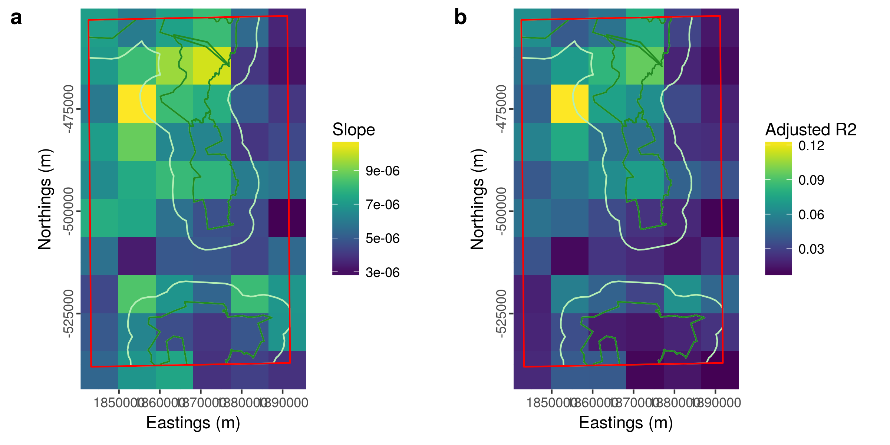

**Fig. 12.** Protection trend Laikipia\]{Slope and adjusted R2 of the GIMMS NDVI3g time series for the study area in Kenya. Green lines indicate outline of protected areas and the surrounding 5 km buffer.

The majority of the study area was covered by grasslands (92.3 - 95.2 %). The remaining parts were mostly covered by open shrublands (1.5 - 5.2 %), cropland/natural vegetation mosaic (0.8 - 2.2 %) and croplands (0.1 - 1.1 %). From 2005 to 2008 percentage cover of cropland/natural vegetation mosaic, woody savannas and grasslands decreased, while open shrublands and croplands increased (Table S4).

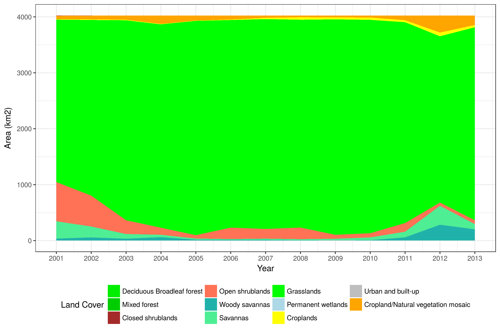 **Fig. 13.** Percentage cover of each land cover class from 2001 - 2013 for the study area in Kenya.

Generally, land cover appeared to be stable over time (2001 - 2013), but, an increase in savannas and cropland/natural vegetation mosaic has been observed in recent years (2011 - 2013) (Fig. 13).

There were 10 different types of land use that occurred in the study area (Community Conservation Area (CCA), Government Land, Large Scale Farms, Mukogodo Group Ranches, Ranches, Rhino Sanctuary, Settlements, Swamp, Trust Land and Urban Settlements) (Fig. S15). 60 % of the study area were covered by ranches, 20 % by settlements and 7 % by trustland, the remaining land use classes only covered a small % of the study area (Table 7).

**Table 7.** Percentage area of each land use class of the study area in Kenya.

<table style="width:54%;">
<colgroup>
<col width="31%" />
<col width="22%" />
</colgroup>
<thead>
<tr class="header">
<th align="center">Land use</th>
<th align="center">Percentage (%)</th>
</tr>
</thead>
<tbody>
<tr class="odd">
<td align="center">CCA</td>
<td align="center">2</td>
</tr>
<tr class="even">
<td align="center">Government Land</td>
<td align="center">3.2</td>
</tr>
<tr class="odd">
<td align="center">Large Scale Farms</td>
<td align="center">0.94</td>
</tr>
<tr class="even">
<td align="center">Mukogodo Group Ranches</td>
<td align="center">3.1</td>
</tr>
<tr class="odd">
<td align="center">Ranches</td>
<td align="center">60</td>
</tr>
<tr class="even">
<td align="center">Rhino Sanctuary</td>
<td align="center">3.6</td>
</tr>
<tr class="odd">
<td align="center">Settlements</td>
<td align="center">19</td>
</tr>
<tr class="even">
<td align="center">Swamp</td>
<td align="center">0.3</td>
</tr>
<tr class="odd">
<td align="center">Trust Land</td>
<td align="center">7.3</td>
</tr>
<tr class="even">
<td align="center">Urban Settlements</td>
<td align="center">0.31</td>
</tr>
</tbody>
</table>

The increasing trend in NDVI was highest in the PAs and lowest in the unprotected areas. The fit of the linear regression was highest in the PAs and lowest in the unprotected areas (Fig. 14).

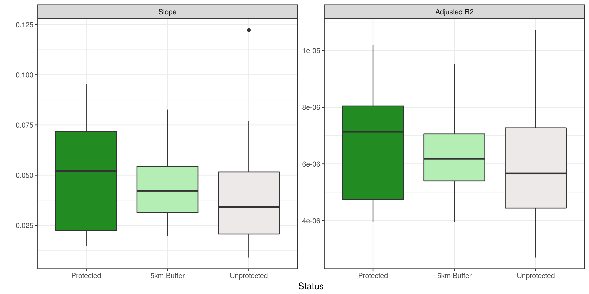 **Fig. 14.** Adjusted R2 and Slope of the GIMMS NDVI3g time series for each protection status (protected, unprotected and 5 km buffer zone) of the study area in Kenya.

### Space use

<!-- What is the space use of Grevy's and plains zebras? Is there a larger difference in space use within or among species? -->
7 Grevy's zebras were tracked for 952 days and 6 plains zebras were tracked for 233 days. Total tracking distance varied between 42 - 3450 km, on average 1147.29 km (± 1136.29 SD) for Grevy's zebras and 361.66 km (± 599.84 SD) for plains zebras (Table 6, Fig. 11). The mean speed varied from 0.07 - 0.20 m/s and was higher for plains zebras (0.11 - 0.2 m/s) than Grevy's zebras (0.07 - 0.11 m/s). Mean step length was 238.05 m (± 102.47 SD) and mean direction varied from -63.76 to 6.71°. The size of 95 % occurrence distribution varied from 6.00 - 437.2 km2. Mean distribution size was higher for Grevy's (204.26 km2 ± 174.52 SD) compared to plains zebras (72.19 km2 ± 47.13 SD) (Table S5). Overlap among individuals varied from 0 - 94.6 %. Overlap among Grevy's zebras ranged from 0 - 94.6 % with an average overlap of 43.85 %, while overlap in plains zebras varied from 0 - 90.26 % with an average of 50.33 %. Overlap between Grevy's and plains zebras' occurrence distribution was 27.23 % (Fig. 15).

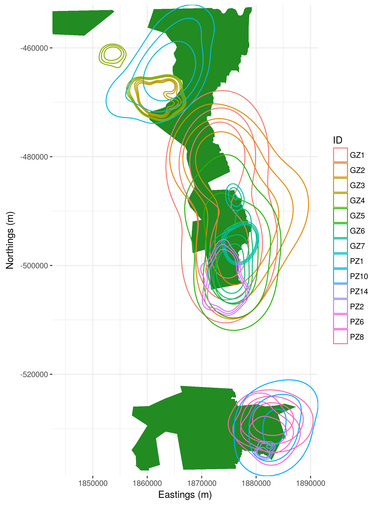 **Fig. 15.** Autocorrelated kernel density estimated utilisation distributions per zebra in Kenya. Protected areas are depicted in darkgreen.

<!-- What is the major driver of habitat use in the two species? -->
While Grevy's zebras were tracked throughout the entire year, plains zebras were only tracked from June - December. During this time, plain's zebras utilised areas with higher EVI and NDVI compared to Grevy's zebras (Fig. 16).

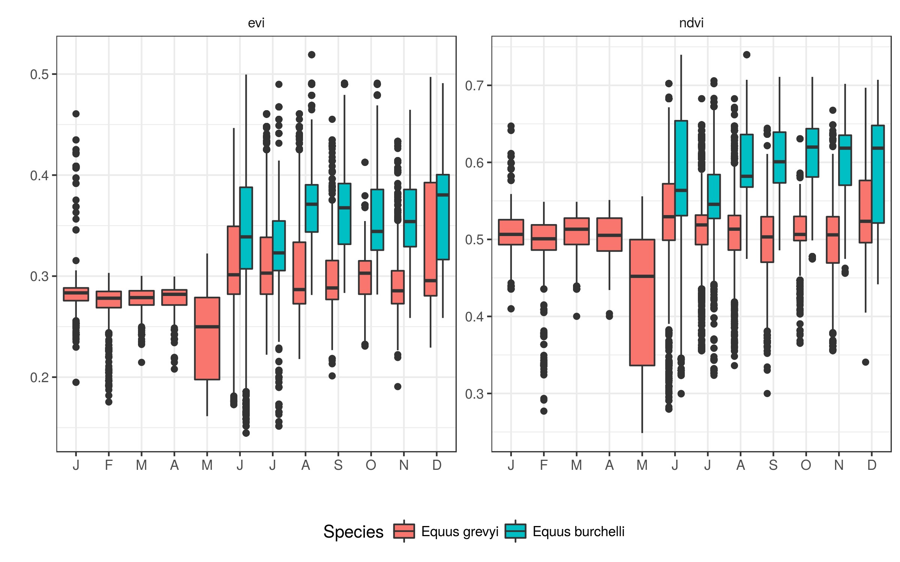

**Fig. 16.** EVI and NDVI and per month experienced by plains and Grevy's zebras in Kenya.

Grevy's as well as plains zebras used mostly grasslands. Grevy's zebras also used open shrublands, while plains zebras used natural vegetation mosaic areas. Only PZ10 used savannas and PZ10 and PZ14 both used woody savannas (Fig. 17).

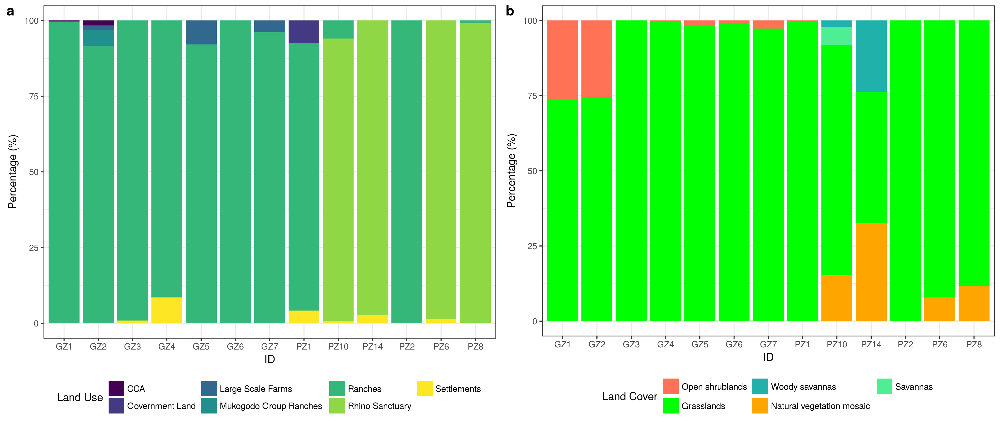

**Fig. 17.** Percentage of observations per land use and land cover per individual in Kenya.

Of the 10 different types of land use, all types apart from swamp were used by the zebras. All Grevy's zebras and two plains zebras (PZ1 and PZ2) occurred mostly on ranches (Fig. 17). The four other plains zebras (PZ6, PZ8, PZ10, PZ14) were limited in their distribution to the eastern part of Ol Pejeta Community Conservancy (Fig. 11), as it is surrounded by a permanent fence, and occurred mostly on rhino sanctuary ground (Fig. 17).

Difference in absolute turning angle and speed between species varied among land use and land cover type. Plains zebras moved slower on ranch land and faster on settlements compared to Grevy's zebras, while absolute turning angle was higher for both in plains zebras compared to Grevy's zebras. In grasslands, plains zebras moved faster than grevy's zebras, while it was the other way around in open shrublands. Absolute turning angle of plains zebras was lower in open shrublands and higher in grasslands compared to the one of Grevy's zebras (Fig. 18).

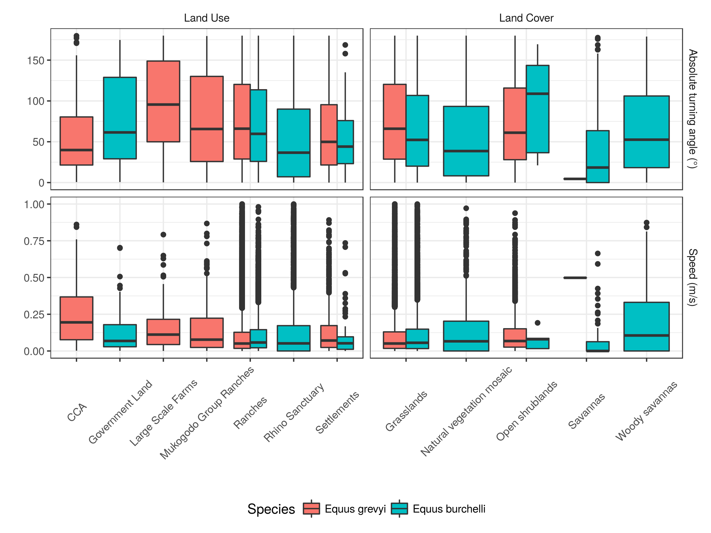

**Fig. 18.** Speed and absolute turning angle per land cover and land use class in Kenya.

### Protection coverage

<!-- How well do the current PAs cover the space use of the two species? -->
There are currently five protected areas within the study area. All of them are small in size (150 - 264 km2), but have been in place for quite some time (1969 - 2004) (Table 8). Only 20.2 % of the study area was protected and 27.9 % of the study area was covered by the 5km buffer zone.

**Table 8.** Summary of the Protected Areas of the study area.

<table>
<colgroup>
<col width="26%" />
<col width="30%" />
<col width="19%" />
<col width="15%" />
<col width="7%" />
</colgroup>
<thead>
<tr class="header">
<th align="center">Name</th>
<th align="center">Designation</th>
<th align="center">IUCN Category</th>
<th align="center">Area (km2)</th>
<th align="center">Year</th>
</tr>
</thead>
<tbody>
<tr class="odd">
<td align="center">Maun</td>
<td align="center">Game Sanctuary</td>
<td align="center">IV</td>
<td align="center">85</td>
<td align="center">1975</td>
</tr>
<tr class="even">
<td align="center">Chobe</td>
<td align="center">National Park</td>
<td align="center">Ib</td>
<td align="center">1.100000e+04</td>
<td align="center">1968</td>
</tr>
<tr class="odd">
<td align="center">Nxai Pan</td>
<td align="center">National Park</td>
<td align="center">Ib</td>
<td align="center">2576</td>
<td align="center">1971</td>
</tr>
<tr class="even">
<td align="center">Moremi</td>
<td align="center">Game Reserve</td>
<td align="center">Ib</td>
<td align="center">4871</td>
<td align="center">1963</td>
</tr>
<tr class="odd">
<td align="center">Makgadikgadi Pans</td>
<td align="center">National Park</td>
<td align="center">Ib</td>
<td align="center">4902</td>
<td align="center">1992</td>
</tr>
<tr class="even">
<td align="center">Okavango Delta System</td>
<td align="center">Ramsar Site, Wetland of International Importance</td>
<td align="center">Not Reported</td>
<td align="center">5.537400e+04</td>
<td align="center">1996</td>
</tr>
<tr class="odd">
<td align="center">Okavango Delta</td>
<td align="center">World Heritage Site</td>
<td align="center">Not Applicable</td>
<td align="center">2.023590e+04</td>
<td align="center">2014</td>
</tr>
</tbody>
</table>

Of the existing PAs only Laikipia National Reserve is formally protected, the other four PAs are community conservancies or private ranches (Table 8, Fig. S14).

33 corridors were identified of which only three corridors belonged to a single plains zebra (PZ2), while the rest belonged to five Grevy's zebras (GZ2, GZ4, GZ5, GZ6, GZ7). Only 25.6 % of the corridors fell within PAs (Fig. S18), while 47.8 % of occurrence distribution is currently protected. 44.74 % of Grevy's zebras' occurrence distribution and 49.11 % of plains zebras' occurrence distribution is covered by protected areas (Fig. 15).

Discussion
----------

<!-- 1. Has there been an increase or loss in vegetation over the last 30 years? -->
The origin of vegetation patterns is important in ecology, as vegetation patterning can affect ecosystem functioning. The majority of the study area was covered by grasslands and the entire study area experienced a significant increase in NDVI from 1981 - 2013 (Fig. 12). Patterning in vegetation varies with rainfall and nutrient availability, but also with herbivory, fire, surface-water processes and soil nutrient-organic matter dynamics (Knegt et al. 2008).

Land cover was relatively stable from 2001 to 2013, but an increase in savannas, woody savannas and cropland/natural vegetation mosaic was observed in recent years (2011 - 2013) (Fig. 13). The increase in cropland could reflect increasing land-use due to population expansion. MODIS Land Cover is only available at a resolution of 500 m and the user accuracy for savannas is quite low (&lt; 45 %). Thus, the observed changes have to be taken with great care, even so changes in land-cover classes should be accurate, even if the absolute land-cover classes are not (Pfeifer et al. 2012b).

<!-- 2. What is the space use of Grevy's and plains zebras? -->
Occurrence distribution was larger for Grevy's than plains zebras, but Grevy's zebras were also tracked much longer than plains zebras (Table 6). Four plains zebras were restricted in their occurrence distribution to the eastern part of Ol Pejeta Conservancy (Fig. 11) by the presence off a fence. The space use of an individual is the interplay between its metabolic demand, body size and resource availability. Grevy's zebras are larger than plains zebras and so are likely to have a larger area requirement. Areas with low resource availability usually force the animal to increase its space use in order to increase the amount of resources it can access (Beest et al. 2011).

Plains zebras moved faster (0.11 - 0.2 m/s) than Grevy's zebras (0.07 - 0.11 m/s). However, some plains zebras (PZ6, PZ8, PZ10, PZ14) were tracked with a very high sampling rate (8 min) and so their movement could be measured much more precisely, which likely resulted in more accurate speeds.

Although, Grevy's and plains zebras generally co-occur in this area (Sundaresan et al. 2012), the overlap between their occurrence distributions was low (27.23 %). First-generation hybrids of female plains zebras and male Grevy’s zebras have been found in the Laikipia ecosystem of northern Kenya. They integrate themselves into plains zebra society and thus are no conservation concern, as it is unlikely that they will dilute the Grevy's zebra gene pool (Cordingley et al. 2009). There is an extensive spatial and temporal overlap between livestock and Grevy's zebras and Grevy's zebra were found to compete with cattle over waterholes (Sundaresan et al. 2008, Low et al. 2009). Vegetation cover loss and soil erosion have been the result of the transition from a nomadic to a sedentary livestock grazing regime. Waterholes are fenced off to stop wildlife from soiling the water or accessing the waterholes during the day. Thus, conditions for Grevy's and plains zebras are less favourable and the risk of predation is increased (Sundaresan et al. 2012).

<!-- Habitat use -->
Studying habitat use and selection is essential for understanding the biological requirements of animals, which is crucial for conservation and management purposes (Freitas et al. 2008). Habitat selection is the process by which individuals choose a specific habitat type among a set of available habitat types (Van Moorter et al. 2016). These decisions can influence the survival and reproductive success of individuals, which can affect the entire population (McLoughlin et al. 2007, Matthiopoulos et al. 2015).

Plains zebras utilised areas with higher NDVI and EVI compared to Grevy's zebras (Fig. 16). This suggests that plains zebras require a higher resource availability compared to Grevy's zebras. This estimate is based on a very low sampling frequency, as only one plains zebras was tracked from July to December (Table 6). 4 plains zebras were tracked in 2005, when a higher NDVI and EVI might have been available. Furthermore, in female plains zebras the forage quality and quantity and habitat openness of locations used varies significantly with reproductive state (Sundaresan et al. 2008).

The study area was covered to 60 % by ranches and 20 % by settlements (Table 7). All Grevy's zebras and the two plains zebras occuring outside Ol Pejeta Community Conservancy (PZ1 and PZ2) occurred mostly on ranches, while the other four plains zebras (PZ6, PZ8, PZ10, PZ14) occurred mostly on rhino sanctuary ground (Fig. 17). However, this is due to the fact that these four zebras were limited in their distribution by a fence.

Grevy's zebras have lower forage quality and drinking requirements than plains zebras (Sundaresan et al. 2008). Plains zebras typically inhabit grasslands (McNaughton and Georgiadis 1986), while Grevy's zebras live on rangelands often shared by pastoral populations (Sundaresan et al. 2008). In Laikipia, the majority of Grevy's zebra habitat is owned by local or pastoral communities and Grevy's zebra have to coexist with livestock, including cattle, sheep, goats and camels (Sundaresan et al. 2012).

The majority of the study area was covered by grasslands (92.3 - 95.2 %). The remaining parts were mostly covered by open shrublands (1.5 - 5.2 %), cropland/natural vegetation mosaic (0.8 - 2.2 %) and croplands (0.1 - 1.1 %) (Table S4). Grevy's as well as plains zebras used mostly grasslands. Grevy's zebras also used open shrublands, while plains zebras also used natural vegetation mosaic areas (Fig. 17). This shows that land cover is not as suitable as vegetation indices, such as NDVI and EVI, for detecting differences in resource use among species. But, land cover was only available every year, while NDVI and EVI varied every 4 days, which logically results in a much better representation of vegetation dynamics.

Habitat selection can not only be inferred from RSFs, but also from the intensity of use of habitat conditions in sites experienced by the animal (Freitas et al. 2008). Individuals increase their use of high-quality resource areas by decreasing their movement rates. Vice versa, sites with low forage availability or high predation risk may stimulate increased movement rates (Fryxell et al. 2008, Avgar et al. 2013, Van Moorter et al. 2016).

Difference in absolute turning angle and speed between species varied among land use and land cover type. Plains zebras moved faster and showed more directional movement than Grevy's zebras in grasslands and vice versa in open shrublands (Fig. 18). This would indicate a preference of Grevy's zebras for open shrublands and a preference of plains zebras for grasslands. For African elephants, Wittemyer et al. (2008b) found that during dry season movement was directional towards food and water, while during the wet season movements were more random.

Land cover data of multiple years was used to compare the habitat use among Grevy's and plains zebras. Although, an easy-to-use MODIS Landcover product from 2001 - 2013 exists and regional to global land cover products from Landsat and SPOT are becoming more widely available (Nagendra et al. 2013), the use of land cover data from multiple dates for analysing animal movement is still rare (Neumann et al. 2015). There are often discrepancies between these different products, as well as between maps generated at the local scale (DeFries et al. 2005). Land cover accuracy of the MODIS product was found to be particularly low for savanna ecosystems (&lt; 45 %) (Cohen et al. 2006). Ecological applications further require a high thematic resolution, but classification accuracy usually decreases with increasing land cover classes (Neumann et al. 2015). Fine-scale movement analysis of animals from GPS-collars might further be particular prone to location errors, as the accuracy of fixes needs to correspond to the animal’s movement behaviour (Bjørneraas et al. 2010). Collar weight and fit can have a significant effect on the rate of travel, as has been shown for plains zebra females in the Makgadikgadi Pans (Brooks et al. 2008). Small differences in collar weight or fit can affect the movement behaviour of an animal, which is particularly relevant for fine-scale movement data.

Individual preference for a specific habitat does not always correspond to the residence time in that habitat, but can also be the result of increased revisitation of certain areas, as areas with a long residence time and areas with a high revisitation rate are not necessarily identical. Water holes, for example, are often visited but only for a short period of time (Van Moorter et al. 2016). The preference of an individual zebra might be driven by the needs of other individuals in the same harem. Lactating plains zebra females have the habitual role of initiating movement in harems and harems containing lactating females are even more likely to lead herd movements. Phenotype and social relationships of group members are thus likely to affect the speed, distance or direction of the movement of plains zebras (Fischhoff et al. 2007b).

<!-- 3. How well do the current PAs cover the space use of the two species? -->
There are currently five PAs, which cover 20 % of the study area, of which only one (Laikipia National Reserve) is formally protected (Table 8). Biodiversity conservation not only requires a number of PAs, but these also need to be well-connected, effectively managed and ecologically representative (Dewi et al. 2013). Although PAs are intented to conserve habitats and species, their effectiveness varies among protection status. While National Parks mostly have firm restrictions on resource use and strong law enforcement, law enforcement is typically sporadic in Nature Reserves, as they are often understaffed (Caro et al. 2009). This leads to different trends in forest loss within and adjacent to PAs depending on their protection status. While conservation efforts in Kenya initially focused on creating PAs for large mammals, the recent focus has shifted towards the support of livelihoods and the alleviation of poverty (Pfeifer et al. 2012a). Data on PAs derived from global databases may suffer from spatial inaccuracies and lack sufficient detail to use for effective monitoring of single protected areas or even regional park networks (Chape et al. 2005, Nagendra et al. 2013). The higher the proportion of a species' range that is protected, the higher the likelihood that the species is truly covered by a PA, even if the management does not ensure the species' long-term persistence (Rodrigues et al. 2004). 45 % of Grevy's zebras' and 49 % of plains zebras' occurrence distribution was covered by PAs (Fig. 15). Half of the plains zebras occurred in the eastern part of the Ol Pejeta Community Conservancy, which is surrounded by a fence, and so there occurrence distribution was completely protected.

<!-- Fences -->
Fences have a negative effect on wild ungulate numbers due to restricted migration to surface waters and summer grazing areas (Coughenour 1991). In Laikipia, fences have mostly been created to prevent elephants from moving out of large private and government-owned ranches and onto smallholder cultivated land (Evans and Adams 2016), but this obviously also affects the movement of zebras.

<!-- Corridors -->
Conservation corridors are useful for maintaining landscape connectivity because they provide a way to facilitate animal movement across fragmented landscapes (Gilbert-Norton et al. 2010). Animal-defined corridors of only five Grevy's and one plains zebra could be identified of which 26 % fell within PAs (Fig. S18). Most animals were probably not tracked for long enough to be able to identify animal-defined corridors.

Conservation corridors may reduce extinction risk, maintain gene flow and facilitate dispersal (Corlatti et al. 2009, LaPoint et al. 2013). Corridors might also provide future routes and habitats in response to climate change, but need to be based on the habitat use and the movement of the organisms (Chetkiewicz et al. 2006). The utility of corridors is species-specific and depends on the width and structure of the corridor. Improving the habitat quality between suitable patches can sometimes be a more cost-effective alternative (Mäkeläinen et al. 2016).

Wildlife in Kenya is still declining in particular within Kenya's PAs (Western et al. 2009). Nearly all indigenous large mammal species in Kenya are more abundant on multiple-use lands than inside parks and reserves. Wildlife and wildlife areas are increasing in Laikipia. Residents still suffer losses to wildlife, either through crop raiding, predation of livestock, damaging infrastructure or compromising human safety, but only derive minimal benefits (Gadd 2005, Young et al. 2005, Bond 2014).

Zebras share many of the same food and water resource needs as livestock and so the protection of zebra habitat would benefit both livestock and local people, but only few people were able to identify the direct benefits of Grevy's zebras. In addition, wildlife species can be beneficial to the local community by providing revenue through tourism or game ranching (Sundaresan et al. 2012). Combining wildlife with moderate livestock production may not only be economically optimal, but can help to preserve biodiversity at the same time (Young et al. 1997). Outreach about the benefits of the species as well as its population decline is needed, local people that share the pasture-land with Grevy’s zebra must get involved and private and community-based measures need to be combined with PAs in order to prevent a further population decline (Western et al. 2009, Sundaresan et al. 2012).

Synthesis
=========

Africa's population is rapidly expanding and as a result land and natural resources are exploited at an alarming rate (Caro et al. 2014, Edwards et al. 2014, Searchinger et al. 2015). To foster future agricultural production (Weng et al. 2013) and mineral exports (Edwards et al. 2014) dozens of development corridors are being implemented. Various of the currently planned development corridors are likely to provide only a small benefit to society, but severly degrade African ecosystems and wildlife (Laurance et al. 2015).

Biodiversity conservation requires ecologically representative and well-connected systems of effectively managed PAs, but often priorities in terms of ecosystem, endemic species, human pressure and the types of management effort have to be set (Dewi et al. 2013). The majority of global priority regions lie in low-income countries in the tropics, which can least afford the costs of establishing and enforcing protected areas. Many of the already existing PAs in these regions are struggling because they are lacking financial resources, which are needed to fulfill their conservation role (Rodrigues et al. 2004). Although a species may be covered by a PA, it does not have to be protected effectively, if adequate management to ensure the species’ long-term persistence is missing. Generally, the larger the proportion of a species’ range that overlaps with PAs, the higher the likelihood that the species is truly covered (Rodrigues et al. 2004).

Ecosystem connectivity can provide organisms access to spatially distributed resources, reduce local extinctions and increase recolonization of habitat fragments, but on a large scale can also facilitate annual migrations and climate-driven range shifts. Thus, increasing landscape connectivity is fundamental for mitigating impacts of climate change and habitat fragmentation (Abrahms et al. 2016, Rayfield et al. 2016). The identification and protection of wildlife corridors has become an important tool in conservation, as they can help to maintain landscape connectivity by promoting animal movement (Gilbert-Norton et al. 2010). However, this depends on the animals capability to utilise these corridors, which can be tested using animal movement data (LaPoint et al. 2013).

In the past, the study of animal movement has mostly focused on the movement behaviours of individuals (Fryxell et al. 2008, Nathan et al. 2008). In order to truly understand the environmental influence on animal movement, multiple individuals across a variety of environmental conditions need to be tracked. Predictive models of population spread and habitat selection can be used to deepen our understanding and may help to develop and implement better conservation strategies that account for the effects of climate and land use change (Naidoo et al. 2012, Avgar et al. 2013). GPS tracking devices are commonly used for the study of animal movement, as they allow for frequent, automatic sampling over long periods of time (Bjørneraas et al. 2010). However, the effect of capture and release as well as the tag itself might have an impact on the animal. Morellet et al. (2009) found that capture and handling and fitting of a GPS collar on roe deer affected the spatial behaviour, habitat use and overall activity level in the first 10 days. Tagging of an animal often causes pain, suffering and distress to the animal (Hawkins 2004). Medium to large-sized wildlife, such as elephants, wildebeest and zebras, can be detected in open savanna using very high resolution satellite imagery (GeoEye-1) (Pettorelli et al. 2014). Individual zebras can be identified by their unique stripe pattern (Grubb 1981). Scouts observed the areas that were heavily used by Grevy's zebra, which closely matched the areas inferred from analyses of GPS-collar data (Low et al. 2009), questioning the need of GPS collars to study the movement of these animals.

Remote Sensing can provide information about spatio-temporal variation in vegetation and land-cover, which can affect animal movement (Pettorelli et al. 2014). In order to model small-scale and high-frequency movement, data on phenology, climate, food and water availability are needed at finer spatial, thematic, and temporal resolution (Rose et al. 2015). Pixel size for those satellites that provide daily observations tends to be between 250 and 1000 m, which is far coarser than the spatio-temporal resolution of GPS-collar-based movement data. The smallest observable feature that can be mapped has to be considerably larger than that, i.e. 3600 m2 for Landsat imagery and 250000 m2 for MODIS data. High resolution data is usually expansive and there is typically a mismatch between spatial and temporal resolution in RS data. The quality of RS data can further be influenced by haze, clouds and shadows (Zeller et al. 2012, Neumann et al. 2015, Willis 2015).

Physical barriers, such as fences or roads, can influence the distribution and ranging behaviour of a species and so isolate populations, reduce genetic diversity, increase susceptibility to diseases and impede access to resources (Bliss-Ketchum et al. 2016), which on the long-term can alter the viability of entire populations (Cozzi et al. 2013). It is important to understand the influence of barriers on the space use of an animal in order to mitigate the effects of such barriers. Responses to barriers will vary among species, as they depend on the animal's movement capabilities, its proximity to the barriers and its habitat preference (Beyer et al. 2016). Accurate informations on barriers are not easy to obtain and even if, they can change frequently (Neumann et al. 2015).

Large herbivores are thought to be detrimental for the maintainance of the functioning of savanna ecosystems (Goheen et al. 2010). Under a business-as-usual scenario, Geometric mean population abundance of terrestrial carnivore and ungulate species declines by 18-35% and extinction risk rises for 8-23%, while an alternative sustainable development scenario could reduce both extinction risk and population losses and lead to population increases (Visconti et al. 2015).

Plains zebras are listed as "Near Threatened" and Grevy's zebras are listed as "Endangered" under the IUCN Red List of Species, as both species have undergone a considerable population decline in the recent past (Moehlman et al. 2013, King and Moehlman 2016). Without conservation actions ungulates would be off far worse (Hoffmann et al. 2015). PAs that integrate local people tend to be more effective at conservation as well as at socio-economic development outcomes (Oldekop et al. 2015). National Parks can provide a large recreational value, which can help to achieve nature conservation goals (Schägner et al. 2016). Engaging local communities in biodiversity conservation and monitoring can be an effective conservation approach, especially in rural Africa (Dolrenry et al. 2016).

Habitat fragmentation and global warming are two of the most important anthropogenic impacts affecting natural ecosystems and the services they provide (Barnes et al. 2015). The boundaries for climate change and rate of biodiversity loss, within which humanity can operate safely, have already been crossed (Rockström et al. 2009). This calls for urgent action to alter our relationship with the planet we inhabit by stopping further habitat destruction and mitigating climate disruption (Steffen et al. 2011, Young et al. 2016).

References
==========

Abrahms, B., S. C. Sawyer, N. R. Jordan, J. W. Mcnutt, A. M. Wilson, and J. S. Brashares. 2016. Does wildlife resource selection accurately inform corridor conservation? Journal of Applied Ecology.

Alerstam, T., A. Hedenström, and S. Akesson. 2003. Long-Distance Migration: Evolution and Determinants. Oikos 103:247–260.

Avgar, T., A. Mosser, G. S. Brown, and J. M. Fryxell. 2013. Environmental and individual drivers of animal movement patterns across a wide geographical gradient. Journal of Animal Ecology 82:96–106.

Ayeri, O. S., V. R. Christian, E. Josef, and H. Michael. 2012. Local perceptions and responses to climate change and variability: The case of Laikipia District, Kenya. Sustainability 4:3302–3325.

Bailey, D. W., J. E. Gross, E. A. Laca, L. R. Rittenhouse, M. B. Coughenour, D. M. Swift, and P. L. Sims. 1996. Mechanisms That Result in Large Herbivore Grazing Distribution Patterns. Journal of Range Management 49:386–400.

Baillieul, T. A. 1979. Makgadikgadi Pans Complex of central Botswana. Geological Society of America Bulletin 90:289–312.

Barnes, A. D., I.-K. Spey, L. Rohde, U. Brose, and A. I. Dell. 2015. Individual behaviour mediates effects of warming on movement across a fragmented landscape. Functional Ecology 29:1543–1552.

Bartlam-Brooks, H. L. A., and S. Harris. 2013. Data from: In search of greener pastures: using satellite images to predict the effects of environmental change on zebra migration. Movebank data repository.

Bartlam-Brooks, H. L. A., P. S. A. Beck, G. Bohrer, and S. Harris. 2013. In search of greener pastures: Using satellite images to predict the effects of environmental change on zebra migration. Journal of Geophysical Research: Biogeosciences 118:1427–1437.

Bartlam-Brooks, H., M. Bonyongo, and S. Harris. 2011. Will reconnecting ecosystems allow long-distance mammal migrations to resume? A case study of a zebra Equus burchelli migration in Botswana.

Barton, P. S., P. E. Lentini, E. Alacs, S. Bau, Y. M. Buckley, E. L. Burns, D. A. Driscoll, L. K. Guja, H. Kujala, J. J. Lahoz-Monfort, A. Mortelliti, R. Nathan, R. Rowe, and A. L. Smith. 2015. Guidelines for Using Movement Science to Inform Biodiversity Policy. Environmental Management 56:791–801.

Bauer, S., and B. J. Hoye. 2014. Migratory animals couple biodiversity and ecosystem functioning worldwide. Science 344:1242552.

Becker, R. A., A. R. Wilks, R. Brownrigg, T. P. Minka, and A. Deckmyn. 2016. maps: Draw Geographical Maps.

Beer, Y. de, and R. J. van Aarde. 2008. Do landscape heterogeneity and water distribution explain aspects of elephant home range in southern Africa’s arid savannas? Journal of Arid Environments 72:2017–2025.

Beest, F. M. van, I. M. Rivrud, L. E. Loe, J. M. Milner, and A. Mysterud. 2011. What determines variation in home range size across spatiotemporal scales in a large browsing herbivore? Journal of Animal Ecology 80:771–785.

Berger, J. 2004. The Last Mile: How to Sustain Long-Distance Migration in Mammals. Conservation Biology 18:320–331.

Berthold, P., and U. Querner. 1981. Genetic Basis of Migratory Behavior in European Warblers. Science 212:77–79.

Beyer, H. L., E. Gurarie, L. Börger, M. Panzacchi, M. Basille, I. Herfindal, B. Van Moorter, S. R. Lele, and J. Matthiopoulos. 2016. ’You shall not pass!’: Quantifying barrier permeability and proximity avoidance by animals. Journal of Animal Ecology 85:43–53.

Bivand, R., T. Keitt, and B. Rowlingson. 2016. rgdal: Bindings for the Geospatial Data Abstraction Library.

Bjørneraas, K., B. Van Moorter, C. M. Rolandsen, and I. Herfindal. 2010. Screening Global Positioning System Location Data for Errors Using Animal Movement Characteristics. The Journal of Wildlife Management 74:1361–1366.

Bliss-Ketchum, L. L., C. E. de Rivera, B. C. Turner, and D. M. Weisbaum. 2016. The effect of artificial light on wildlife use of a passage structure. Biological Conservation 199:25–28.

Boettiger, A. N., G. Wittemyer, R. Starfield, F. Volrath, and W. M. Getz. 2015. Inferring ecological and behavioral drivers of African elephant movement using a linear filtering approach. Ecology 92:1648–1657.

Bohrer, G., P. S. A. Beck, S. M. Ngene, A. K. Skidmore, and I. Douglas-Hamilton. 2014. Elephant movement closely tracks precipitation-driven vegetation dynamics in a Kenyan forest-savanna landscape. Movement Ecology 2:2.

Bolger, D. T., W. D. Newmark, T. A. Morrison, and D. F. Doak. 2008. The need for integrative approaches to understand and conserve migratory ungulates. Ecology Letters 11:63–77.

Bond, J. 2014. Conflict, development and security at the agro-pastoral-wildlife nexus: A case of Laikipia County, Kenya. The Journal of Development Studies 50:991–1008.

Boone, R. B., S. J. Thirgood, and J. G. C. Hopcraft. 2006. Serengeti Wildebeest Migratory Patterns Modeled From Rainfall and New Vegetation Growth. Ecology 87:1987–1994.

Boyce, M. S., P. R. Vernier, S. E. Nielsen, and F. K. A. Schmiegelow. 2002. Evaluating resource selection functions. Ecological Modelling 157:281–300.

Bracis, C., and T. Mueller. 2017. Memory, not just perception, plays an important role in terrestrial mammalian migration. Proceedings of the Royal Society B: Biological Sciences 284.

Breman, H., and C. T. de Wit. 1983. Rangeland productivity and exploitation in the sahel. Science 221:1341–1347.

Brooks, C., C. Bonyongo, and S. Harris. 2008. Effects of Global Positioning System Collar Weight on Zebra Behavior and Location Error. Journal of Wildlife Management 72:527–534.

Brooks, T. M., R. A. Mittermeier, C. G. Mittermeier, G. A. B. Da Fonseca, A. B. Rylands, W. R. Konstant, P. Flick, J. Pilgrim, S. Oldfield, G. Magin, and C. Hilton-Taylor. 2002. Habitat Loss and Extinction in the Hotspots of Biodiversity. Conservation Biology 16:909–923.

Burkhard, B., F. Kroll, S. Nedkov, and F. Müller. 2012. Mapping ecosystem service supply, demand and budgets. Ecological Indicators 21:17–29.

Butchart, S. H. M., M. Clarke, R. J. Smith, R. E. Sykes, J. P. W. Scharlemann, M. Harfoot, G. M. Buchanan, A. Angulo, A. Balmford, B. Bertzky, T. M. Brooks, K. E. Carpenter, M. T. Comeros-Raynal, J. Cornell, G. F. Ficetola, L. D. C. Fishpool, R. A. Fuller, J. Geldmann, H. Harwell, C. Hilton-Taylor, M. Hoffmann, A. Joolia, L. Joppa, N. Kingston, I. May, A. Milam, B. Polidoro, G. Ralph, N. Richman, C. Rondinini, D. B. Segan, B. Skolnik, M. D. Spalding, S. N. Stuart, A. Symes, J. Taylor, P. Visconti, J. E. M. Watson, L. Wood, and N. D. Burgess. 2015. Shortfalls and Solutions for Meeting National and Global Conservation Area Targets. Conservation Letters 8:n/a–n/a.

Cagnacci, F., S. Focardi, A. Ghisla, B. van Moorter, E. H. Merrill, E. Gurarie, M. Heurich, A. Mysterud, J. Linnell, M. Panzacchi, R. May, T. Nygård, C. Rolandsen, and M. Hebblewhite. 2016. How many routes lead to migration? Comparison of methods to assess and characterize migratory movements. Journal of Animal Ecology 85:54–68.

Campo-Bescós, M. A., R. Muñoz-Carpena, J. Southworth, L. Zhu, P. R. Waylen, and E. Bunting. 2013. Combined Spatial and Temporal Effects of Environmental Controls on Long-Term Monthly NDVI in the Southern Africa Savanna. Remote Sensing 5:6513–6538.

Caro, T., A. Dobson, A. J. Marshall, and C. A. Peres. 2014. Compromise solutions between conservation and road building in the tropics. Current Biology 24:R722–R725.

Caro, T., T. A. Gardner, C. Stoner, E. Fitzherbert, and T. R. B. Davenport. 2009. Assessing the effectiveness of protected areas: Paradoxes call for pluralism in evaluating conservation performance. Diversity and Distributions 15:178–182.

Cattarino, L., C. A. Mcalpine, and J. R. Rhodes. 2016. Spatial scale and movement behaviour traits control the impacts of habitat fragmentation on individual fitness. Journal of Animal Ecology 85:168–177.

Chape, S., J. Harrison, M. Spalding, and I. Lysenko. 2005. Measuring the extent and effectiveness of protected areas as an indicator for meeting global biodiversity targets. Philosophical transactions of the Royal Society of London. Series B, Biological sciences 360:443–455.

Chapman, B. B., C. Brönmark, J. Å. Nilsson, and L. A. Hansson. 2011. The ecology and evolution of partial migration. Oikos 120:1764–1775.

Chetkiewicz, C.-L. B., C. C. St. Clair, and M. S. Boyce. 2006. Corridors for Conservation: Integrating Pattern and Process. Annual Review of Ecology, Evolution, and Systematics 37:317–342.

Cohen, W. B., T. K. Maiersperger, D. P. Turner, W. D. Ritts, D. Pflugmacher, R. E. Kennedy, A. Kirschbaum, S. W. Running, M. Costa, and S. T. Gower. 2006. MODIS land cover and LAI collection 4 product quality across nine sites in the western hemisphere. IEEE Transactions on Geoscience and Remote Sensing 44:1843–1857.

Cooke, H. J. 1979. The origin of the Makgadikgadi Pans. Botswana Notes and Records 11:37–42.

Cooke, S. J., S. G. Hinch, M. Wikelski, R. D. Andrews, L. J. Kuchel, T. G. Wolcott, and P. J. Butler. 2004. Biotelemetry: A mechanistic approach to ecology. Trends in Ecology and Evolution 19:334–343.

Cordingley, J. E., S. R. Sundaresan, I. R. Fischhoff, B. Shapiro, J. Ruskey, and D. I. Rubenstein. 2009. Is the endangered Grevy’s zebra threatened by hybridization? Animal Conservation 12:505–513.

Corlatti, L., K. Hackländer, and F. Frey-Roos. 2009. Ability of wildlife overpasses to provide connectivity and prevent genetic isolation. Conservation Biology 23:548–556.

Corlett, R. T. 2015. The Anthropocene concept in ecology and conservation. Trends in Ecology and Evolution 30:36–41.

Coughenour, M. B. 1991. Spatial components of plant-herbivore interactions in pastoral, ranching, and native ungulate ecosystems. Journal of Range Management 44.

Coughenour, M. B., S. J. McNaughton, and L. L. Wallace. 1985. Responses of an African Graminoid (Themeda triandra Forsk.) to Frequent Defoliation, Nitrogen, and Water: A Limit of Adaptation to Herbivory. Oecologia 68:105–110.

Cozzi, G., F. Broekhuis, J. W. McNutt, and B. Schmid. 2013. Comparison of the effects of artificial and natural barriers on large African carnivores: implications for interspecific relationships and connectivity. The Journal of animal ecology 82:707–15.

Craigie, I. D., J. E. M. Baillie, A. Balmford, C. Carbone, B. Collen, R. E. Green, and J. M. Hutton. 2010. Large mammal population declines in Africa’s protected areas. Biological Conservation 143:2221–2228.

Crist, E. P., and R. C. Cicone. 1984. A Physically-Based Transformation of Thematic Mapper Data - The TM Tasseled Cap. IEEE Transactions on Geoscience and Remote Sensing 22:256–263.

Crutzen, P. J. 2002. Geology of mankind. Nature 415:23.

Darling, F. F. 1960. An Ecological Reconnaissance of the Mara Plains in Kenya Colony. Wildlife Monographs 5:5–41.

De Jager, N. R., and J. Pastor. 2009. Declines in moose population density at Isle Royle National Park, MI, USA and accompanied changes in landscape patterns. Landscape Ecology 24:1389–1403.

De Solla, S. R., R. Bonduriansky, and R. J. Brooks. 1999. Eliminating autocorrelation reduces biological relevance of home range estimates. Journal of Animal Ecology 68:221–234.

De Vos, J. M., L. N. Joppa, J. L. Gittleman, P. R. Stephens, and S. L. Pimm. 2015. Estimating the normal background rate of species extinction. Conservation Biology 29:452–462.

DeFries, R., A. Hansen, A. C. Newton, and M. C. Hansen. 2005. Increasing Isolation of Protected Areas in Tropical Forests over the past Twenty Years. Ecological Applications 15:19–26.

DeFries, R., K. K. Karanth, and S. Pareeth. 2010. Interactions between protected areas and their surroundings in human-dominated tropical landscapes. Biological Conservation 143:2870–2880.

Demšar, U., K. Buchin, F. Cagnacci, K. Safi, B. Speckmann, N. Van de Weghe, D. Weiskopf, R. Weibel, N. V. D. Weghe, D. Weiskopf, and R. Weibel. 2015. Analysis and visualisation of movement: an interdisciplinary review. Movement Ecology 3:1–24.

Dewi, S., M. V. Noordwijk, A. Ekadinata, and J.-l. Pfund. 2013. Protected areas within multifunctional landscapes: Squeezing out intermediate land use intensities in the tropics? Land Use Policy 30:38–56.

Dingle, H., and V. A. Drake. 2007. What Is Migration? BioScience 57:113–121.

Dirzo, R., H. S. Young, M. Galetti, G. Ceballos, N. J. B. Isaac, and B. Collen. 2014. Defaunation in the Anthropocene. Science 345:401–406.

Dolrenry, S., L. Hazzah, and L. G. Frank. 2016. Conservation and monitoring of a persecuted African lion population by Maasai warriors. Conservation Biology 30:467–475.

Driscoll, D. A., S. C. Banks, P. S. Barton, K. Ikin, P. Lentini, D. B. Lindenmayer, A. L. Smith, L. E. Berry, E. L. Burns, A. Edworthy, M. J. Evans, R. Gibson, R. Heinsohn, B. Howland, G. Kay, N. Munro, B. C. Scheele, I. Stirnemann, D. Stojanovic, N. Sweaney, N. R. Villaseñor, and M. J. Westgate. 2014. The trajectory of dispersal research in conservation biology. Systematic review. PLoS ONE 9.

Dudley, N., editor. 2008. Guidelines for Protected Area Management Categories. Page x + 86. IUCN, Gland, Switzerland.

Durant, S. M., T. M. Caro, D. A. Collins, R. M. Alawi, and C. D. Fitzgibbon. 1988. Migration Patterns of Thomson’s Gazelles and Cheetahs on the Serengeti Plains Tanzania. African Journal of Ecology 26:257–268.

Edwards, D. P., S. Sloan, L. Weng, P. Dirks, J. Sayer, and W. F. Laurance. 2014. Mining and the African environment. Conservation Letters 7:302–311.

Ellery, W. N., and T. S. McCarthy. 1998. Environmental change over two decades since dredging and excavation of the lower Boro River, Okavango Delta, Botswana. Journal of Biogeography 25:361–378.

Estes, R. D. 1976. The significance of breeding synchrony in the wildebeest. African Journal of Ecology 14:135–152.

Evans, L. A., and W. M. Adams. 2016. Fencing elephants: The hidden politics of wildlife fencing in Laikipia, Kenya. Land Use Policy 51:215–228.

Fahrig, L. 2003. Effects of Habitat Fragmentation on Biodiversity. Annual Review of Ecology Evolution and Systematics 34:487–515.

Fahrig, L. 2007. Non-optimal animal movement in human-altered landscapes. Functional Ecology 21:1003–1015.

Feyisa, G. L., H. Meilby, R. Fensholt, and S. R. Proud. 2014. Automated Water Extraction Index: A new technique for surface water mapping using Landsat imagery. Remote Sensing of Environment 140:23–35.

Fischer, J., and D. B. Lindenmayer. 2007. Landscape modification and habitat fragmentation: A synthesis. Global Ecology and Biogeography 16:265–280.

Fischhoff, I. R., S. R. Sundaresan, J. Cordingley, and D. I. Rubenstein. 2007a. Habitat use and movements of plains zebra (Equus burchelli) in response to predation danger from lions. Behavioral Ecology 18:725–729.

Fischhoff, I. R., S. R. Sundaresan, J. Cordingley, H. M. Larkin, M. J. Sellier, and D. I. Rubenstein. 2007b. Social relationships and reproductive state influence leadership roles in movements of plains zebra, Equus burchellii. Animal Behaviour 73:825–831.

Fisher, A., N. Flood, and T. Danaher. 2016. Comparing Landsat water index methods for automated water classification in eastern Australia. Remote Sensing of Environment 175:167–182.

Fleming, C. H., and J. M. Calabrese. 2016. ctmm: Continuous-Time Movement Modeling.

Fleming, C. H., W. F. Fagan, T. Mueller, K. A. Olson, P. Leimgruber, J. M. Calabrese, and E. G. Cooch. 2015. Rigorous home range estimation with movement data: A new autocorrelated kernel density estimator. Ecology 96:1182–1188.

Foley, J. A., R. Defries, G. P. Asner, C. Barford, G. Bonan, S. R. Carpenter, F. S. Chapin, M. T. Coe, G. C. Daily, H. K. Gibbs, J. H. Helkowski, T. Holloway, E. A. Howard, C. J. Kucharik, C. Monfreda, J. a Patz, I. C. Prentice, N. Ramankutty, P. K. Snyder, J. A. Foley, R. Defries, G. P. Asner, C. Barford, G. Bonan, S. R. Carpenter, F. S. Chapin, M. T. Coe, G. C. Daily, H. K. Gibbs, J. H. Helkowski, T. Holloway, E. A. Howard, C. J. Kucharik, C. Monfreda, J. a Patz, I. C. Prentice, N. Ramankutty, and P. K. Snyder. 2005. Global Consequences of Land Use. Science 309:570–574.

Forester, J. D., H. K. Im, and P. J. Rathouz. 2009. Accounting for animal movement in estimation of resource selection functions: Sampling and data analysis. Ecology 90:3554–3565.

Freitas, C., K. M. Kovacs, C. Lydersen, and R. A. Ims. 2008. A novel method for quantifying habitat selection and predicting habitat use. Journal of Applied Ecology 45:1213–1220.

Fryxell, J. 1987. Food limitation and demography of a migratory antelope, the white-eared kob. Oecologia 72:83–91.

Fryxell, J. M., and A. R. E. Sinclair. 1988. Causes and consequences of migration by large herbivores. Trends in Ecology and Evolution 3:237–241.

Fryxell, J. M., M. Hazell, L. Börger, B. D. Dalziel, D. T. Haydon, J. M. Morales, T. McIntosh, and R. C. Rosatte. 2008. Multiple movement modes by large herbivores at multiple spatiotemporal scales. Proceedings of the National Academy of Sciences of the United States of America 105:19114–9.

Fryxell, J. M., J. F. Wilmshurst, A. R. E. Sinclair, D. T. Haydon, R. D. Holt, and P. A. Abrams. 2005. Landscape scale, heterogeneity, and the viability of Serengeti grazers. Ecology Letters 8:328–335.

Gadd, M. E. 2005. Conservation outside of parks: attitudes of local people in Laikipia, Kenya. Environmental Conservation 32:50–63.

Georgiadis, N., M. Hack, and K. Turpin. 2003. The influence of rainfall on zebra population dynamics: Implications for management. Journal of Applied Ecology 40:125–136.

Gereta, E., and E. Wolanski. 1998. Wildlife-water quality interactions in the Serengeti National Park, Tanzania. African Journal of Ecology 36:1–14.

Gilbert-Norton, L., R. Wilson, J. R. Stevens, and K. H. Beard. 2010. A meta-analytic review of corridor effectiveness. Conservation Biology 24:660–668.

Goheen, J. R., T. M. Palmer, F. Keesing, C. Riginos, and T. P. Young. 2010. Large herbivores facilitate savanna tree establishment via diverse and indirect pathways. Journal of Animal Ecology 79:372–382.

Grubb, P. 1981. Equus burchelli. Mammalian Species 157:1–9.

Hack, M. a, R. East, D. I. Rubenstein, and E. Gray. 2002. Status and Action Plan for the Plains Zebra (Equus burchellii). Status survey and conservation action plan:43–60.

Hansen, A. J., R. DeFries, and W. Turner. 2004. Land Use Change and Biodiversity: A Synthesis of Rates and Consequences during the Period of Satellite Imagery. Pages 277–299 *in* G. Gutman and C. Justice, editors. Land change science: Ob- serving, monitoring, and understanding trajectories of change on the earth’s surface. Springer Verlag, New York.

Harris, G., S. Thirgood, J. G. C. Hopcraft, J. P. G. M. Cromsigt, and J. Berger. 2009. Global decline in aggregated migrations of large terrestrial mammals. Endangered Species Research 7:55–76.

Hawkins, P. 2004. Bio-logging and animal welfare : practical refinements. Memoirs of National Institute of Polar Research 58:58–68.

Hebblewhite, M., E. Merrill, and G. McDermid. 2008. A Multi-Scale Test of the Forage Maturation Hypothesis in a Partially Migratory Ungulate Population. Ecological Monographs 78:141–166.

Henry, P. Y., S. Lengyel, P. Nowicki, R. Julliard, J. Clobert, T. Čelik, B. Gruber, D. S. Schmeller, V. Babij, and K. Henle. 2008. Integrating ongoing biodiversity monitoring: Potential benefits and methods. Biodiversity and Conservation 17:3357–3382.

Hijmans, R. J., S. E. Cameron, J. L. Parra, P. G. Jones, and A. Jarvis. 2005. Very high resolution interpolated climate surfaces for global land areas. International Journal of Climatology 25:1965–1978.

Hof, C., I. Levinsky, M. B. Araújo, and C. Rahbek. 2011. Rethinking species’ ability to cope with rapid climate change. Global Change Biology 17:2987–2990.

Hoffmann, M., J. W. Duckworth, K. Holmes, D. P. Mallon, A. S. L. Rodrigues, and S. N. Stuart. 2015. The difference conservation makes to extinction risk of the world’s ungulates. Conservation Biology 29:n/a—–n/a.

Honrado, J. P., H. M. Pereira, and A. Guisan. 2016. Fostering integration between biodiversity monitoring and modelling. Journal of Applied Ecology 53:1299–1304.

Horn, B. K. P. 1981. Hill Shading and the Reflectance Map. Proceedings of the IEEE 69:14–47.

Huete, A., K. Didan, T. Miura, E. P. Rodriguez, X. Gao, and L. G. Ferreira. 2002. Overview of the radiometric and biophysical performance of the MODIS vegetation indices. Remote Sensing of Environment 83:195–213.

IPCC. 2013. Climate Change 2013: The Physical Science Basis. Contribution of Working Group I to the Fifth Assessment Report of the Intergovernmental Panel on Climate Change. Intergovernmental Panel on Climate Change.

Jarman, P., and A. Sinclair. 1979. Feeding strategy and the pattern of resource partitioning in ungulates. Pages 130–163 *in* A. Sinclair and M. Norton-Griffiths, editors. Serengeti: Dynamics of an ecosystem. University of Chicago Press, Chicago.

Jeltsch, F., D. Bonte, G. Pe’er, B. Reineking, P. Leimgruber, N. Balkenhol, B. Schröder, C. M. Buchmann, T. Mueller, N. Blaum, D. Zurell, K. Böhning-Gaese, T. Wiegand, J. A. Eccard, H. Hofer, J. Reeg, U. Eggers, and S. Bauer. 2013. Integrating movement ecology with biodiversity research - exploring new avenues to address spatiotemporal biodiversity dynamics. Movement ecology 1:6.

Jin, S., and S. A. Sader. 2005. Comparison of time series tasseled cap wetness and the normalized difference moisture index in detecting forest disturbances. Remote Sensing of Environment 94:364–372.

Jones, C. G., J. H. Lawton, and M. Shachak. 1994. Organisms as Ecosystem Engineers. Oikos 69:373–386.

Kaczensky, P., R. Kuehn, B. Lhagvasuren, S. Pietsch, W. Yang, and C. Walzer. 2011. Connectivity of the Asiatic wild ass population in the Mongolian Gobi. Biological Conservation 144:920–929.

Katzner, T. E., D. Brandes, T. Miller, M. Lanzone, C. Maisonneuve, J. A. Tremblay, R. Mulvihill, and G. T. Merovich. 2012. Topography drives migratory flight altitude of golden eagles: Implications for on-shore wind energy development. Journal of Applied Ecology 49:1178–1186.

Kerk, M. van de, D. P. Onorato, M. A. Criffield, B. M. Bolker, B. C. Augustine, S. A. Mckinley, and M. K. Oli. 2015. Hidden semi-Markov models reveal multiphasic movement of the endangered Florida panther. Journal of Animal Ecology 84:576–585.

Kgathi, D. K., and M. C. Kalikawe. 1993. Seasonal distribution of zebra and wildebeest in Makgadikgadi Pans Game Reserve, Botswana. African Journal of Ecology 31:210–219.

Kgathi, D., B. N. Ngwenya, and M. K. Darkoh, editors. 2014. Rural livelihoods, risk and political economy of access to natural resources in the Okavango Delta, Botswana. Nova Science Publishers, Inc., New York.

King, S., and P. Moehlman. 2016. Equus quagga. The IUCN Red List of Threatened Species 2016: e.T41013A45172424.

Knegt, H. J. de, T. A. Groen, C. A. D. M. van de Vijver, H. H. T. Prins, and F. Van Langevelde. 2008. Herbivores as architects of savannas: inducing and modifying spatial vegetation patterning. Oikos 117:543–554.

Knegt, H. J. de, F. Van Langevelde, A. K. Skidmore, A. Delsink, R. Slotow, S. Henley, G. Bucini, W. F. De Boer, M. B. Coughenour, C. C. Grant, I. M. A. Heitkönig, M. Henley, N. M. Knox, E. M. Kohi, E. Mwakiwa, B. R. Page, M. Peel, Y. Pretorius, S. E. Van Wieren, and H. H. T. Prins. 2011. The spatial scaling of habitat selection by African elephants. Journal of Animal Ecology 80:270–281.

Kreulen, D. 1975. Wildebeest habitat selection on the Serengeti plains, Tanzania, in relation to calcium and lactation: a preliminary report\*. African Journal of Ecology 13:297–304.

Lambin, E. F., B. L. Turner, H. J. Geist, S. B. Agbola, A. Angelsen, J. W. Bruce, O. T. Coomes, R. Dirzo, G. Fischer, C. Folke, P. S. George, K. Homewood, J. Imbernon, R. Leemans, X. Li, E. F. Moran, M. Mortimore, P. S. Ramakrishnan, J. F. Richards, H. Skanes, W. Steffen, G. D. Stone, U. Svedin, T. A. Veldkamp, C. Vogel, and J. Xu. 2001. The causes of land-use and land-cover change: Moving beyond the myths. Global Environmental Change 11:261–269.

LaPoint, S., P. Gallery, M. Wikelski, and R. Kays. 2013. Animal behavior, cost-based corridor models, and real corridors. Landscape Ecology 28:1615–1630.

Laurance, W. F., S. Sloan, L. Weng, and J. A. Sayer. 2015. Estimating the Environmental Costs of Africa’s Massive “Development Corridors”. Current Biology:1–7.

Lele, S. R., E. H. Merrill, J. Keim, and M. S. Boyce. 2013. Selection, use, choice and occupancy: Clarifying concepts in resource selection studies. Journal of Animal Ecology 82:1183–1191.

Leverington, F., K. L. Costa, H. Pavese, A. Lisle, and M. Hockings. 2010. A global analysis of protected area management effectiveness. Environmental Management 46:685–698.

Lewis, S. L., and M. A. Maslin. 2015. Defining the Anthropocene. Nature 519:171–180.

Loarie, S. R., R. J. V. Aarde, and S. L. Pimm. 2009. Fences and artificial water affect African savannah elephant movement patterns. Biological Conservation 142:3086–3098.

Low, B., S. R. Sundaresan, I. R. Fischhoff, and D. I. Rubenstein. 2009. Partnering with local communities to identify conservation priorities for endangered Grevy’s zebra. Biological Conservation 142:1548–1555.

Matthiopoulos, J., J. Fieberg, G. Aarts, H. L. Beyer, J. M. Morales, and D. T. Haydon. 2015. Establishing the link between habitat-selection and animal population dynamics. Ecological Monographs 85.

Mattiuzzi, M. 2016. MODIS: MODIS Acquisition and Processing.

Mäkeläinen, S., H. J. de Knegt, O. Ovaskainen, and I. K. Hanski. 2016. Home-range use patterns and movements of the Siberian flying squirrel in urban forests: Effects of habitat composition and connectivity. Movement Ecology 4:5.

McClintock, B. T., D. S. Johnson, M. B. Hooten, J. M. Ver Hoef, and J. M. Morales. 2014. When to be discrete: the importance of time formulation in understanding animal movement. Movement Ecology:1–14.

McFeeters, S. K. 1996. International Journal of Remote Sensing. International Journal of Remote Sensing 17:1425–1432.

McKinney, M. L. 2002. Urbanization, Biodiversity, and Conservation. BioScience 52:883.

McLoughlin, P. D., J.-M. Gaillard, M. S. Boyce, C. Bonenfant, F. Messier, P. Duncan, D. Delorme, B. Van Moorter, S. Saïd, and F. Klein. 2007. Lifetime reproductive success and composition of the home range in a large herbivore. Ecology 88:3192–3201.

McNaughton, S. 1976. Serengeti Migratory Wildebeest: Facilitation of Energy Flow by Grazing. Science 191:92–94.

McNaughton, S. 1983. Compensatory Plant Growth as a Response to Herbivory as a response to herbivory. Oikos 40:329–336.

McNaughton, S. 1985. Ecology of a Grazing Ecosystem: The Serengeti. Ecological Monographs 55:260–294.

McNaughton, S. J. 1979. Grazing as an optimization process: grass-ungulated relationships in the serengeti. American Naturalist 113:691–703.

McNaughton, S. J. 1988. Mineral nutrition and spatial concentrations of African ungulates. Nature 334:343–345.

McNaughton, S. J., F. F. Banyikwa, and M. M. Mcnaughton. 1997. Promotion of the Cycling of Diet-Enhancing Nutrients by African Grazers. Science 278:1798–1800.

McNaughton, S., and N. J. Georgiadis. 1986. Ecology of african grazing and browsing mammals. Annual Review of Ecology and Systematics 17:39–65.

Millenium Ecosystem Assessment. 2005. Ecosystems and human well-being: Synthesis. Pages 1–100. Millennium Ecosystem Assessment Panel, Washington, DC.

Miller, R. I., and L. D. Harris. 1977. Isolation and extirpations in wildlife reserves. Biological Conservation 12:311–315.

Moehlman, P. D. 2002. Equids: Zebras, Asses and Horses. Status Survey and Conservation Action Plan. IUCN/SSC Equid Specialist Group, Gland, Switzerland; Cambridge, UK.

Moehlman, P., D. Rubenstein, and F. Kebede. 2013. Equus grevyi. The IUCN Red List of Threatened Species 2013: e.T7950A21070406.

Morellet, N., H. Verheyden, J.-M. Angibault, B. Cargnelutti, B. Lourtet, M. A. J. Hewison, and H. Ne Verheyden. 2009. The Effect of Capture on Ranging Behaviour and Activity of the European Roe Deer Capreolus capreolus. Wildl. Biol 15:278–287.

Mueller, T., and W. F. Fagan. 2008. Search and navigation in dynamic environments - from individual behaviours to population distributions. Oikos 117:654–664.

Mueller, T., K. A. Olson, G. Dressler, P. Leimgruber, T. K. Fuller, C. Nicolson, A. J. Novaro, M. J. Bolgeri, D. Wattles, S. Destefano, J. M. Calabrese, and W. F. Fagan. 2011. How landscape dynamics link individual- to population-level movement patterns: A multispecies comparison of ungulate relocation data. Global Ecology and Biogeography 20:683–694.

Mueller, T., K. A. Olson, T. K. Fuller, G. B. Schaller, M. G. Murray, and P. Leimgruber. 2008. In search of forage: Predicting dynamic habitats of Mongolian gazelles using satellite-based estimates of vegetation productivity. Journal of Applied Ecology 45:649–658.

Nagendra, H. 2008. Do Parks Work? Impact of Protected Areas on Land Cover Clearing. Ambio 37:330–337.

Nagendra, H., R. Lucas, J. P. Honrado, R. H. G. Jongman, C. Tarantino, M. Adamo, P. Mairota, J. Pradinho, R. H. G. Jongman, C. Tarantino, M. Adamo, and P. Mairota. 2013. Remote sensing for conservation monitoring: Assessing protected areas, habitat extent, habitat condition, species diversity, and threats. Ecological Indicators 33:45–59.

Nagendra, H., S. Paul, S. Pareeth, and S. Dutt. 2009. Landscapes of protection: Forest change and fragmentation in Northern West Bengal, India. Environmental Management 44:853–864.

Naidoo, R., M. J. Chase, P. Beytell, P. Du Preez, K. Landen, G. Stuart-Hill, and R. Taylor. 2014. A newly discovered wildlife migration in Namibia and Botswana is the longest in Africa. Oryx 50:1–9.

Naidoo, R., P. Du Preez, G. Stuart-Hill, M. Jago, and M. Wegmann. 2012. Home on the range: Factors explaining partial migration of African buffalo in a tropical environment. PLoS ONE 7.

NASA JPL. 2013. NASA Shuttle Radar Topography Mission Global 1 arc second. NASA LP DAAC.

Nathan, R., W. M. Getz, E. Revilla, M. Holyoak, R. Kadmon, D. Saltz, and P. E. Smouse. 2008. A movement ecology paradigm for unifying organismal movement research. Proceedings of the National Academy of Sciences of the United States of America 105:19052–19059.

Neumann, W., S. Martinuzzi, A. B. Estes, A. M. Pidgeon, H. Dettki, G. Ericsson, and V. C. Radeloff. 2015. Opportunities for the application of advanced remotely-sensed data in ecological studies of terrestrial animal movement. Movement Ecology 3:8.

Newmark, W. D. 2008. Isolation of African protected areas. Frontiers in Ecology and the Environment 6:321–328.

Newmark, W. D., and J. L. Hough. 2000. Conserving Wildlife in Africa: Integrated Conservation and Development Projects and Beyond: Because multiple factors hinder integrated conservation and development projects in Africa from achieving their objectives, alternative and complementary approache. BioScience 50:585–592.

Nicholson, E., and H. P. Possingham. 2006. Objectives for multiple-species conservation planning. Conservation Biology 20:871–881.

Nogeire, T. M., F. W. Davis, K. R. Crooks, B. H. McRae, L. M. Lyren, and E. E. Boydston. 2015. Can Orchards Help Connect Mediterranean Ecosystems? Animal Movement Data Alter Conservation Priorities. The American Midland Naturalist 174:105–116.

Okitsu, S. 2005. Factors controlling geographical distribution in savanna vegetation in Namibia. African Study Monograph 30:135–151.

Oldekop, J. A., G. Holmes, W. E. Harris, and K. L. Evans. 2015. A global assessment of the social and conservation outcomes of protected areas. Conservation Biology 30:133–141.

Oliveira-Santos, L. G. R., J. D. Forester, U. Piovezan, W. M. Tomas, and F. A. S. Fernandez. 2016. Incorporating animal spatial memory in step selection functions. Journal of Animal Ecology 85:516–524.

Olson, K. A., T. K. Fuller, T. Mueller, M. G. Murray, C. Nicolson, D. Odonkhuu, S. Bolortsetseg, and G. B. Schaller. 2010. Annual movements of Mongolian gazelles: Nomads in the Eastern Steppe. Journal of Arid Environments 74:1435–1442.

Opdam, P., and D. Wascher. 2004. Climate change meets habitat fragmentation: Linking landscape and biogeographical scale levels in research and conservation. Biological Conservation 117:285–297.

Panzacchi, M., B. Van Moorter, O. Strand, M. Saerens, I. Kivimäki, C. C. St. Clair, I. Herfindal, and L. Boitani. 2016. Predicting the continuum between corridors and barriers to animal movements using Step Selection Functions and Randomized Shortest Paths. Journal of Animal Ecology 85:32–42.

Pereira, H. M., P. W. Leadley, V. Proença, R. Alkemade, J. P. W. Scharlemann, J. F. Fernandez-Manjarrés, M. B. Araújo, P. Balvanera, R. Biggs, W. W. L. Cheung, L. Chini, H. D. Cooper, E. L. Gilman, S. Guénette, G. C. Hurtt, H. P. Huntington, G. M. Mace, T. Oberdorff, C. Revenga, P. Rodrigues, R. J. Scholes, U. R. Sumaila, and M. Walpole. 2010. Scenarios for global biodiversity in the 21st century. Science 330:1496–1501.

Perkins, J. 1996. Botswana: fencing out the equity issue. Cattleposts and cattle ranching in the Kalahari Desert. Journal of Arid Environments 33:503–517.

Pettorelli, N., S. Ryan, T. Mueller, N. Bunnefeld, B. Jedrzejewska, M. Lima, and K. Kausrud. 2011. The Normalized Difference Vegetation Index (NDVI): Unforeseen successes in animal ecology. Climate Research 46:15–27.

Pettorelli, N., K. Safi, and W. Turner. 2014. Introduction: Satellite remote sensing, biodiversity research and conservation of the future. Philosophical Transactions of the Royal Society of London B Biological Sciences 369:20130190.

Pettorelli, N., J. O. Vik, A. Mysterud, J. M. Gaillard, C. J. Tucker, and N. C. Stenseth. 2005. Using the satellite-derived NDVI to assess ecological responses to environmental change. Trends in Ecology and Evolution 20:503–510.

Pfeifer, M., N. D. Burgess, R. D. Swetnam, P. J. Platts, S. Willcock, and R. Marchant. 2012a. Protected Areas: Mixed Success in Conserving East Africa’s Evergreen Forests. PLoS ONE 7:1–10.

Pfeifer, M., M. Disney, T. Quaife, and R. Marchant. 2012b. Terrestrial ecosystems from space: A review of earth observation products for macroecology applications. Global Ecology and Biogeography 21:603–624.

Pinzon, J. E., and C. J. Tucker. 2014. A non-stationary 1981-2012 AVHRR NDVI3g time series. Remote Sensing 6:6929–6960.

Rayfield, B., D. Pelletier, M. Dumitru, J. A. Cardille, and A. Gonzalez. 2016. Multipurpose habitat networks for short-range and long-range connectivity: A new method combining graph and circuit connectivity. Methods in Ecology and Evolution 7:222–231.

Redfern, J. V., C. C. Grant, A. Gaylard, and W. M. Getz. 2005. Surface water availability and the management of herbivore distributions in an African savanna ecosystem. Journal of Arid Environments 63:406–424.

Rivrud, I. M., L. E. Loe, and A. Mysterud. 2010. How does local weather predict red deer home range size at different temporal scales? Journal of Animal Ecology 79:1280–1295.

Rockström, J., W. Steffen, K. Noone, A. Persson, F. S. Chapin III, E. Lambin, T. M. Lenton, M. Scheffer, C. Folke, H. Schellnhuber, B. Nykvist, C. A. De Wit, T. Hughes, S. van der Leeuw, H. Rodhe, S. Sorlin, P. K. Snyder, R. Costanza, U. Svedin, M. Falke, and J. Foley. 2009. Planetary Boundaries: Exploring the safe operating space for humanity. Ecology and Society 14.

Rodrigues, A. S. L., H. R. Akçakaya, S. J. Andelman, M. I. Bakarr, L. Boitani, T. M. Brooks, J. S. Chanson, L. D. C. Fishpool, G. a. B. Da Fonseca, K. J. Gaston, M. Hoffmann, P. a. Marquet, J. D. Pilgrim, R. L. Pressey, J. Schipper, W. Sechrest, S. N. Stuart, L. G. Underhill, R. W. Waller, M. E. J. Watts, and X. Yan. 2004. Global Gap Analysis: Priority Regions for Expanding the Global Protected-Area Network. BioScience 54:1092.

Rondinini, C., S. Stuart, and L. Boitani. 2005. Habitat suitability models and the shortfall in conservation planning for African vertebrates. Conservation Biology 19:1488–1497.

Rose, R. A., D. Byler, J. R. Eastman, E. Fleishman, G. Geller, S. Goetz, L. Guild, H. Hamilton, M. Hansen, R. Headley, J. Hewson, N. Horning, B. A. Kaplin, N. Laporte, A. Leidner, P. Leimgruber, J. Morisette, J. Musinsky, L. Pintea, A. Prados, V. C. Radeloff, M. Rowen, S. Saatchi, S. Schill, K. Tabor, W. Turner, A. Vodacek, J. Vogelmann, M. Wegmann, D. Wilkie, and C. Wilson. 2015. Ten ways remote sensing can contribute to conservation. Conservation Biology 29:350–359.

Sawyer, H., M. J. Kauffman, R. M. Nielson, and J. S. Horne. 2009. Identifying and prioritizing ungulate migration routes for landscape-level conservation. Ecological Applications 19:2016–2025.

Schägner, J. P., L. Brander, J. Maes, M. L. Paracchini, and V. Hartje. 2016. Mapping recreational visits and values of European National Parks by combining statistical modelling and unit value transfer. Journal for Nature Conservation 31:71–84.

Scholes, R. J., G. Mace, W. Turner, G. N. Geller, N. Jurgens, A. Larigauderie, D. Muchoney, B. a Walther, H. Mooney, N. Jürgens, A. Larigauderie, D. Muchoney, B. a Walther, and H. Mooney. 2008. Toward a Global Biodiversity Observing System. Science 321:1044–1045.

Schweiger, A. K., M. Schütz, P. Anderwald, M. E. Schaepman, M. Kneubühler, R. Haller, and A. C. Risch. 2015. Foraging ecology of three sympatric ungulate species - Behavioural and resource maps indicate differences between chamois, ibex and red deer. Movement Ecology 3:6.

Searchinger, T. D., L. Estes, P. K. Thornton, T. Beringer, A. Notenbaert, D. Rubenstein, R. Heimlich, R. Licker, and M. Herrero. 2015. High carbon and biodiversity costs from converting Africa’s wet savannahs to cropland. Nature Climate Change 5:481–486.

Serneels, S., and E. F. Lambin. 2001. Impact of Land-Use Changes on the Wildebeest Migration in the Northern Part of the Serengeti-Mara Ecosystem. Journal of Biogeography 28:391–407.

Shorrocks, B., and W. Bates. 2014. The biology of African savannahs. OUP Oxford.

Sinclair, A., H. Dublin, and M. Borner. 1985. Population regulation of Serengeti Wildebeest: a test of the food hypothesis. Oecologia 65:266–268.

Singh, N. J., I. A. Grachev, A. B. Bekenov, and E. J. Milner-Gulland. 2010. Tracking greenery across a latitudinal gradient in central Asia - the migration of the saiga antelope. Diversity and Distributions 16:663–675.

Steffen, W., P. J. Crutzen, and J. R. Mcneill. 2007. The Anthropocene: Are Humans Now Overwhelming the Great Forces of Nature. Ambio 36:614–621.

Steffen, W., A. Persson, L. Deutsch, J. Zalasiewicz, M. Williams, K. Richardson, C. Crumley, P. Crutzen, C. Folke, L. Gordon, M. Molina, V. Ramanathan, J. Rockström, M. Scheffer, H. J. Schellnhuber, and U. Svedin. 2011. The anthropocene: From global change to planetary stewardship. Ambio 40:739–761.

Sundaresan, S. R., I. R. Fischhoff, J. Dushoff, and D. I. Rubenstein. 2007. Network metrics reveal differences in social organization between two fission-fusion species, Grevy’s zebra and onager. Oecologia 151:140–149.

Sundaresan, S. R., I. R. Fischhoff, H. M. Hartung, P. Akilong, and D. I. Rubenstein. 2008. Habitat choice of Grevy’s zebras (Equus grevyi) in Laikipia, Kenya. African Journal of Ecology 46:359–364.

Sundaresan, S., B. Bruyere, G. Parker, B. Low, N. Stafford, and S. Davis. 2012. Pastoralists’ Perceptions of the Endangered Grevy’s Zebra in Kenya. Human Dimensions of Wildlife 17:270–281.

Talbot, L. M., and M. H. Talbot. 1963. The Wildebeest in Western Masailand, East Africa. Wildlife Monographs 12:3–88.

Taylor, C. M., and D. R. Norris. 2007. Predicting conditions for migration: effects of density dependence and habitat quality. Biology letters 3:280–3.

Teitelbaum, C. S., W. F. Fagan, C. H. Fleming, G. Dressler, J. M. Calabrese, P. Leimgruber, and T. Mueller. 2015. How far to go? Determinants of migration distance in land mammals. Ecology Letters 18:545–552.

Thirgood, S., A. Mosser, S. Tham, J. Hopcraft, E. Mwangomo, T. Mlengeya, M. Kilewo, J. Fryxell, a. R. E. Sinclair, and M. Borner. 2004. Can parks protect migratory ungulates? The case of the Serengeti wildebeest. The Zoological Society of London 7:113–120.

Tibblin, P., A. Forsman, T. Borger, and P. Larsson. 2016. Causes and consequences of repeatability, flexibility and individual fine-tuning of migratory timing in pike. Journal of Animal Ecology 85:136–145.

Toor, M. L. van, S. H. Newman, J. Y. Takekawa, and M. Wegmann. 2016. Temporal segmentation of animal trajectories informed by habitat use. Ecosphere 7:1–16.

Tracey, J. A., J. Zhu, E. Boydston, L. Lyren, R. N. Fisher, and K. R. Crooks. 2013. Mapping behavioral lansdcapes for animal movement: a finite mixture modeling approach. Ecological Applications 23:654–669.

Trierweiler, C., W. C. Mullié, R. H. Drent, K. M. Exo, J. Komdeur, F. Bairlein, A. Harouna, M. De Bakker, and B. J. Koks. 2013. A Palaearctic migratory raptor species tracks shifting prey availability within its wintering range in the Sahel. Journal of Animal Ecology 82:107–120.

Turner, W., S. Spector, N. Gardiner, M. Fladeland, E. Sterling, and M. Steininger. 2003. Remote sensing for biodiversity science and conservation. Trends in Ecology and Evolution 18:306–314.

Ulrich, A., C. Ifejika Speranza, P. Roden, B. Kiteme, U. Wiesmann, and M. Nüsser. 2012. Small-scale farming in semi-arid areas: Livelihood dynamics between 1997 and 2010 in Laikipia, Kenya. Journal of Rural Studies 28:241–251.

Van Moorter, B., C. M. Rolandsen, M. Basille, and J.-m. Gaillard. 2016. Movement is the glue connecting home ranges and habitat selection. Journal of Animal Ecology 85:21–31.

Varis, O., C. Tortajada, and A. Biswas. 2008. Management of transboundary rivers and lakes. Page 315. Springer-Verlag Berlin Heidelberg.

Visconti, P., M. Bakkenes, D. Baisero, T. Brooks, S. H. M. Butchart, L. Joppa, R. Alkemade, M. Di Marco, L. Santini, M. Hoffmann, L. Maiorano, R. L. Pressey, A. Arponen, L. Boitani, A. E. Reside, D. P. van Vuuren, and C. Rondinini. 2015. Projecting Global Biodiversity Indicators under Future Development Scenarios. Conservation Letters 9:5–13.

Visconti, P., R. L. Pressey, D. Giorgini, L. Maiorano, M. Bakkenes, L. Boitani, R. Alkemade, A. Falcucci, F. Chiozza, and C. Rondinini. 2011. Future hotspots of terrestrial mammal loss. Philosophical transactions of the Royal Society of London. Series B, Biological sciences 366:2693–2702.

Vorovencii, I. 2007. Use of the “ Tasseled Cap ” Transformation for the Interpretation of Satellite Images. Cadastre Journal 07:75–82.

Wardle, D. A., R. D. Bardgett, J. N. Klironomos, H. Setälä, W. H. van der Putten, and D. H. Wall. 2004. Ecological linkages between aboveground and belowground biota. Science 304:1629–33.

Wegmann, M., L. Santini, B. Leutner, K. Safi, D. Rocchini, M. Bevanda, H. Latifi, S. Dech, and C. Rondinini. 2014. Role of African protected areas in maintaining connectivity for large mammals. Philosophical transactions of the Royal Society of London. Series B, Biological sciences 369:20130193.

Weng, L., A. K. Boedhihartono, P. H. G. M. Dirks, J. Dixon, M. I. Lubis, and J. A. Sayer. 2013. Mineral industries, growth corridors and agricultural development in Africa. Global Food Security 2:195–202.

Western, D., S. Russell, and I. Cuthil. 2009. The status of wildlife in protected areas compared to non-protected areas of Kenya. PLoS ONE 4.

White, K. H., and F. Eckardt. 2006. Geochemical mapping of carbonate sediments in the Makgadikgadi basin, Botswana using moderate resolution remote sensing data. Earth Surface Processes and Landforms 31:665–681.

White, P. J., T. L. Davis, K. K. Barnowe-Meyer, R. L. Crabtree, and R. A. Garrott. 2007. Partial migration and philopatry of Yellowstone pronghorn. Biological Conservation 135:518–526.

Widmann, M., A. Kato, B. Raymond, F. Angelier, B. Arthur, O. Chastel, M. Pellé, T. Raclot, and Y. Ropert-Coudert. 2015. Habitat use and sex-specific foraging behaviour of Adélie penguins throughout the breeding season in Adélie Land, East Antarctica. Movement Ecology 3:30.

Wilcove, D. S., and M. Wikelski. 2008. Going, going, gone: Is animal migration disappearing? PLoS Biology 6:1361–1364.

Willis, K. S. 2015. Remote sensing change detection for ecological monitoring in United States protected areas. Biological Conservation 182:233–242.

Wittemyer, G., P. Elsen, W. T. Bean, a C. O. Burton, and J. S. Brashares. 2008a. Accelerated human population growth at protected area edges. Science 321:123–126.

Wittemyer, G., L. Polansky, I. Douglas-Hamilton, and W. M. Getz. 2008b. Disentangling the effects of forage, social rank, and risk on movement autocorrelation of elephants using Fourier and wavelet analyses. Proceedings of the National Academy of Sciences of the United States of America 105:19108–13.

Xu, H. 2006. Modification of normalised difference water index (NDWI) to enhance open water features in remotely sensed imagery. International Journal of Remote Sensing 27:3025–3033.

Young, H. S., D. J. McCauley, M. Galetti, and R. Dirzo. 2016. Patterns, Causes, and Consequences of Anthropocene Defaunation. Annual Review of Ecology, Evolution, and Systematics 47:annurev–ecolsys–112414–054142.

Young, T. P., B. Okello, D. Kinyua, and T. Palmer. 1997. KLEE: a long-term multi-species herbivore exclusion experiment in Laikipia, Kenya. African Journal of Range and Forage Science 14:92–104.

Young, T. P., T. M. Palmer, and M. E. Gadd. 2005. Competition and compensation among cattle, zebras, and elephants in a semi-arid savanna in Laikipia, Kenya. Biological Conservation 122:351–359.

Zeller, K. A., K. McGarigal, and A. R. Whiteley. 2012. Estimating landscape resistance to movement: A review. Landscape Ecology 27:777–797.

Zhang, X., C. Schaaf, M. Friedl, A. Strahler, F. Gao, and J. Hodges. 2002. MODIS tasseled cap transformation and its utility. IEEE International Geoscience and Remote Sensing Symposium 2:1063–1065.
